# Overview

Welcome to the pilot for **self-service validation of your provisioning
integration with Azure Logic apps**!

The Entra App Provisioning and Single Sign-On teams are currently
working on building a revamped onboarding experience where ISVs can
self-service onboard their provisioning or SSO integrations to the
Microsoft Entra app gallery. This will enable you to bring your
application into the Microsoft ecosystem faster and more efficiently
than ever before.

The self-service onboarding experience will consist of multiple
components:

1.  A process to self-service validate that your provisioning
    integration is ready to onboard to the Microsoft Entra app gallery
    via a provided Azure Logic app template

2.  A process to self-service validate that your SSO integration is
    ready to onboard to the Microsoft Entra app gallery via a browser
    extension

3.  An intake form in the Entra portal where you can submit a publishing
    request for your SSO and/or provisioning application

This document walks you through **\#1**, the process of self-service
validating that your provisioning integration is ready to onboard to the
Microsoft Entra app gallery. We are seeking your feedback on the
validation experience, including what you enjoy and what we can improve.

## Disclaimer

This feature is currently in PREVIEW. This information relates to a
pre-release product that may be substantially modified before it's
released. Microsoft makes no warranties, expressed or implied, with
respect to the information provided here.

## Support for preview

Microsoft Premier support will not provide support during the pilot. If
you have questions or feedback to provide, you may reach out to the
feature team managing this pilot at <aaduserprovisioning@microsoft.com>.

# Onboarding requirements

*<u>Technical requirements</u>*

For your application to be eligible to onboard to the Microsoft Entra
app gallery, your provisioning integration must meet the following
requirements:

- Support a SCIM 2.0 user or group endpoint (only one is required, but
  supporting both a user and group endpoint is recommended)

- Support the OAuth 2.0 Client Credentials grant as your primary
  authentication method

  - Note: Client Credentials is not required to participate in this
    pilot (i.e. you will be able to test the Logic app template using a
    bearer token). However, Client Credentials will be required to
    onboard to the Microsoft Entra app gallery

  - Currently, Client Credentials is the only authentication method we
    support for requests to onboard new provisioning integrations to the
    Microsoft Entra app gallery

- Support updating multiple group memberships with a single PATCH
  request

- Support at least 25 requests per second per tenant to ensure that
  users and groups can be provisioned and deprovisioned without delay

- Your SCIM endpoint does not require features that Microsoft does not
  support today. Examples of features that the non-gallery SCIM app does
  not currently support:

  - Verbose PATCH calls

  - Support for batching calls (i.e. including multiple add operations
    in the same PATCH call)

  - Rate limiting

*<u>Validation requirements</u>*

This document provides you with instructions on how to self-service
validate your application, so that it is ready to onboard to the
Microsoft Entra app gallery. Once you complete the instructions in this
document, you will have completed the following pre-requisites:

- You should have set up a non-gallery SCIM app with a successful sync.
  This step requires:

  - A SCIM endpoint. If you need guidance on how to develop a SCIM
    endpoint, you can refer to our public documentation:
    <https://learn.microsoft.com/entra/identity/app-provisioning/use-scim-to-provision-users-and-groups>

  - An Entra ID tenant. If you don’t already have one, you can follow
    the instructions here to create one:
    <https://learn.microsoft.com/entra/identity-platform/quickstart-create-new-tenant>

  - You must have at least an **Application Administrator** role in the
    Entra ID tenant.

  - If your app will support only group provisioning, an [Entra ID
    Premium P1
    license](https://learn.microsoft.com/entra/fundamentals/licensing)
    is required for group-only provisioning to function (a P1 license is
    not required if “Provision all” is selected). A trial license will
    work. *Note: If you have an [M365 E3 or E5
    license](https://www.microsoft.com/microsoft-365/enterprise/microsoft-365-plans-and-pricing),
    Entra Premium is included as part of those license packages.*

- You should complete a successful run of our Logic app validation
  template, with no errors returned. This step requires:

  - In the same tenant where your non-gallery SCIM app is hosted, an
    Azure subscription for Logic app testing. The Logic app template
    functions on a [consumption
    model](https://learn.microsoft.com/azure/logic-apps/single-tenant-overview-compare),
    meaning that you will likely incur a small monetary cost as a result
    of running the Logic app. This cost is expected to be small (less
    than 10 USD per month on an [Azure pay-as-you-go
    subscription](https://azure.microsoft.com/pricing/purchase-options/azure-account/search?icid=hybrid-cloud&ef_id=_k_CjwKCAiA8vXIBhAtEiwAf3B-gwGo45BSp9MkHu1_SsZHPGytGsYgUoGgKhwiVKvh4pCybuz62bqCnhoCYlgQAvD_BwE_k_&OCID=AIDcmm5edswduu_SEM__k_CjwKCAiA8vXIBhAtEiwAf3B-gwGo45BSp9MkHu1_SsZHPGytGsYgUoGgKhwiVKvh4pCybuz62bqCnhoCYlgQAvD_BwE_k_&gad_source=1&gad_campaignid=21496728177&gbraid=0AAAAADcJh_siQ5FaD4VnPUpZunMKSJ2sy&gclid=CjwKCAiA8vXIBhAtEiwAf3B-gwGo45BSp9MkHu1_SsZHPGytGsYgUoGgKhwiVKvh4pCybuz62bqCnhoCYlgQAvD_BwE)).

  - You must have permissions to create a Logic app under the
    appropriate subscription and resource group. This will require at
    least a [Logic app
    contributor](https://learn.microsoft.com/azure/logic-apps/logic-apps-securing-a-logic-app?tabs=azure-portal)
    role, but more permissions may be required depending on whether you
    also need to create a subscription and resource group.

*<u>Publishing requirements</u>*

While not required to participate in this pilot, the following is
required to complete the self-service publishing experience once it
becomes available for Private Preview in CY2026:

- Your tenant must be registered as a partner in Microsoft Partner
  Center and enrolled in the Microsoft AI Cloud Partner program.

- You must have documentation for your SCIM endpoint ready to publish.
  Once Private Preview starts, a documentation template will be
  available for you to use.

  - End customers should be able to access documentation about your SCIM
    endpoint on both your website and the Microsoft Learn website.

- Please provide us with engineering and support contacts for us to
  refer end customers to once your application is published to the
  Microsoft Entra app gallery.

# Set up your non-gallery SCIM app

As mentioned in the [Requirements section](#_Requirements), before you
validate your provisioning integration, you must set up a non-gallery
SCIM app with your desired configuration and start a successful sync
with that app. This section describes how to do so.

## Requirements

In the [Onboarding requirements section](#onboarding-requirements),
review the *Validation requirements* list to ensure that you have
everything you need to set up a non-gallery SCIM app.

## Instructions

1.  Sign in to the Entra portal at
    [entra.microsoft.com](https://entra.microsoft.com).

2.  Select **Enterprise applications \> New application \> Create your
    own application**.

3.  Enter the name of your app, integration options, and click
    **Create**.

4.  Take note of the **Object ID** (this will be referred to as
    servicePrincipalID in the logic App).

5.  Set **Provisioning Mode** to **Automatic**, enter your bearer token
    details, and select **Test Connection**.

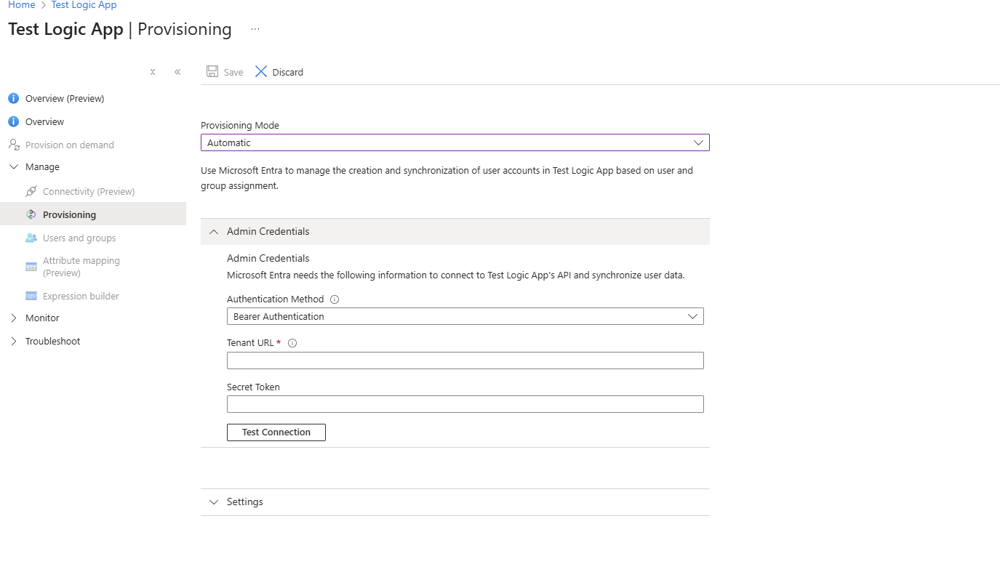

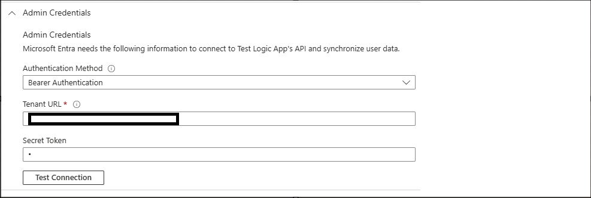

6.  Create a provisioning job by creating connection and set up schema
    by navigating to **Provisioning \> Mappings \> Provision Users**.
    For more details on how to customize schema, you can check out our
    public documentation here: [Tutorial - Customize Microsoft Entra
    attribute mappings in Application Provisioning - Microsoft Entra ID
    \| Microsoft
    Learn](https://learn.microsoft.com/en-us/entra/identity/app-provisioning/customize-application-attributes)

7.  In the **Overview** page, select **Start Provisioning** to start a
    provisioning job. If the provisioning job commences without errors,
    you are ready to move on to the next section.

8.  **Optional:** Once you’ve successfully started a provisioning job,
    submit an allow list request for faster sync cycles via this form:
    [Allow List for Self-Service Validation of Provisioning Integration
    (Pilot) – Fill out
    form](https://forms.microsoft.com/Pages/ResponsePage.aspx?id=v4j5cvGGr0GRqy180BHbR1xPIYfdXw5FhHBIH8BxY9ZUQ0w0UEczQTdLT1gzUTIyVzVNOUFHTjNGQS4u).
    The Entra App Provisioning team will then work on allow listing your
    tenant and provisioning job. Once complete, you will have access to
    sync cycles that run more frequently than the standard 40-minute
    sync cycle, allowing you to test and iterate upon your provisioning
    integration quickly.

# Set up a Logic app for running automated tests

Once you have set up a non-gallery SCIM app and started the sync, you
will use our provided Logic app template to validate your provisioning
integration and ensure that it is ready to publish to the Microsoft
Entra app gallery.

Once we release the full private preview for the full onboarding and
publishing experience, a successful run of the Logic app template will
allow you to submit a publishing request for your provisioning
integration, after which we will review and deploy your app.

## Requirements

In the [Onboarding requirements section](#onboarding-requirements),
review the *Validation requirements* list to ensure that you have
everything you need to set up a Logic app.

## Instructions

1.  Sign in to the Azure portal at <https://portal.azure.com>. You
    should use the same tenant as the one where you set up your
    non-gallery SCIM app.

2.  Use the searchbar to navigate to the **Subscriptions** blade.

3.  Select the appropriate Azure subscription and create a resource
    group. This is the subscription and resource group that your Logic
    app will be attached to.

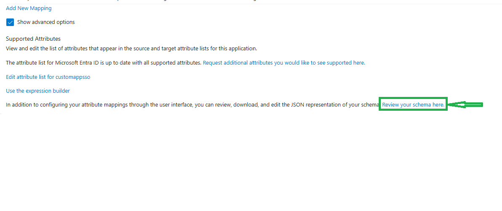

4.  Use the searchbar to navigate to the **Logic app**s blade.

5.  Select **Add \> Multi-tenant (consumption)**. *Note: The Logic app
    functioning on a consumption model means that you may be billed on
    your Azure description depending on level of usage. The amount is
    expected to be small—see the [Onboarding requirements
    section](#onboarding-requirements) for more details, under*
    Validation requirements*.*

6.  Configure the settings of your Logic app as desired. Once you are
    done, click **Review + create**.

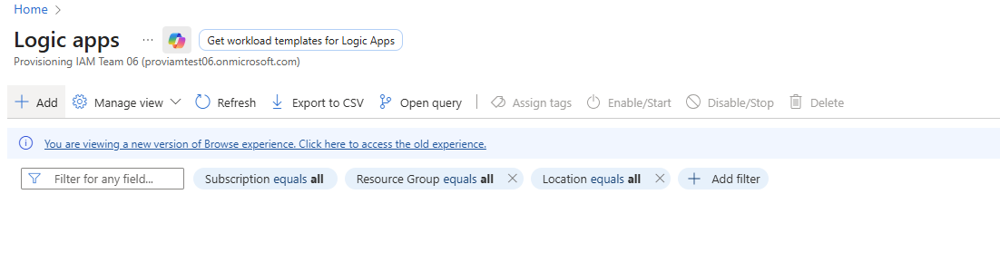

7.  Once the Logic app finishes deploying, open the Logic app.

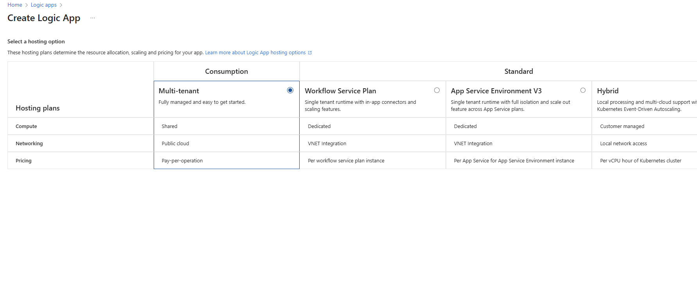

8.  Download the **logicAppTemplate.json **file from
    the** Microsoft.SCIM.LogicAppValidationTemplate** folder of our GitHub repository: <u>https://github.com/AzureAD/SCIMReferenceCode/tree/master/Microsoft.SCIM.LogicAppValidationTemplate</u> (copy/paste
    this URL into your browser). *Note: The folder includes
    a **README.md** file that lists out the various tests that the Logic
    app will run. This may be helpful for your reference.*

9.  In the Logic app, select **Development Tools \> Logic app code
    view**. Copy/paste the code from the template in the previous step
    and click **Save**. The **Logic app designer** view should then
    update with the various test cases that our template will
    automatically run for you.

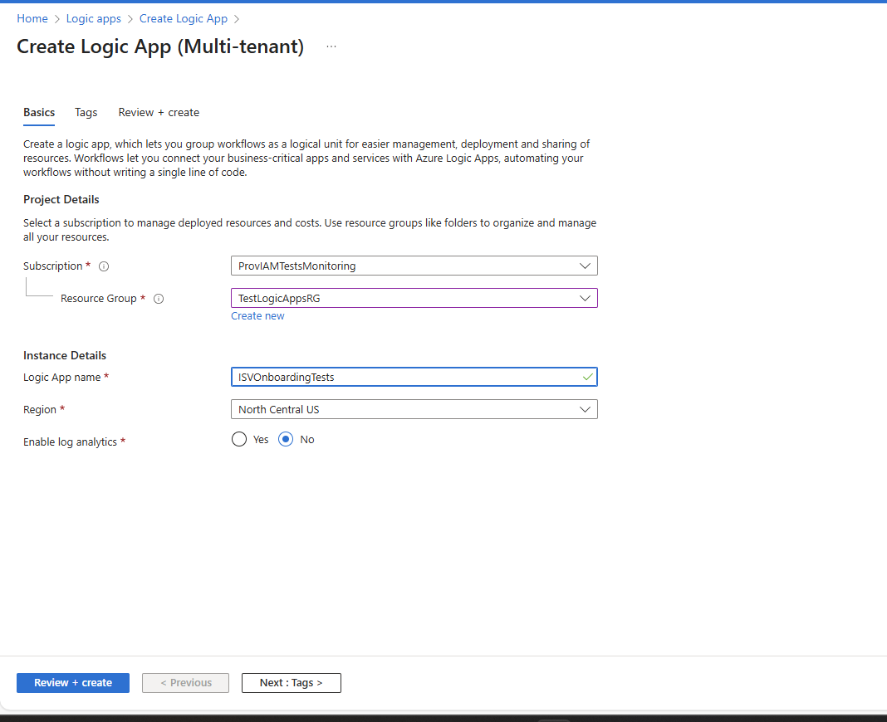

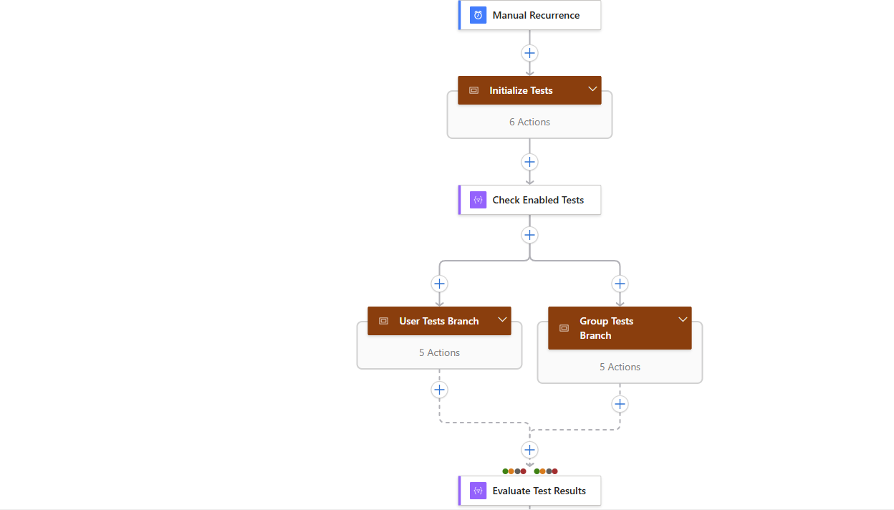

10. Next, we will enable system-assigned managed identity for secure
    resource access. Select **Settings \> Identity**.

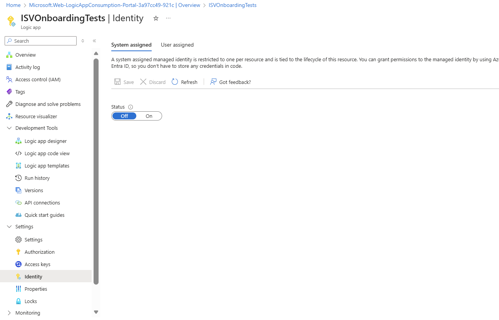

11. Set the **Status** in the **System assigned** tab to **On**. Select
    **Yes** in the confirmation dialog that pops up.

12. Select **Save**.

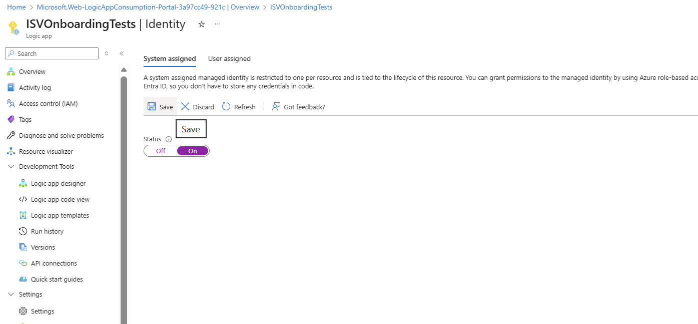

13. Take note of the object ID of the managed identity. You will need
    this object ID for the script that you will run in a few steps.

14. Now let’s work on granting the owner role to the Logic app. Select
    **Azure role assignments**.

15. In the **Azure role assignments** page, click on **Add role
    assignment** and select the **Owner** role.

Once the owner role has been granted to the Logic app, you can now work
on assigning the proper permissions to the Logic app so that it can
invoke various Graph queries as part of the automated tests it will run
(the Logic app will create, update, and delete users and groups, query
provisioning logs, etc.).

You may choose to use Azure CLI or PowerShell for the following steps.

16. Go to the sample script provided in the
    [appendix](#script-for-assigning-permissions-to-your-logic-app) of
    this document. Copy the script for your records, and update the
    value of the **\$logicAppManagedId** field with the object ID of
    your Logic app’s managed identity.

17. Run the script using the command-line interface of your choice. If
    using a UI like Azure Cloud Shell that provides you with an option
    to upload a file, you may opt to copy the script into a file, upload
    the file, then run the script.

*<u>How to upload and run a script using Azure Cloud Shell</u>*

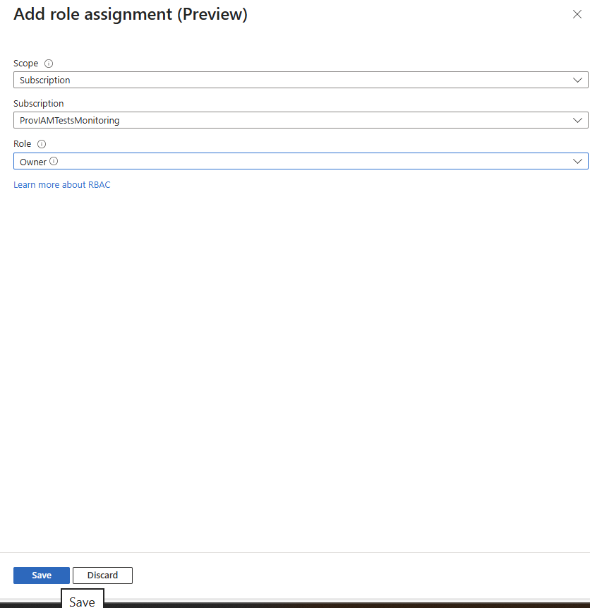

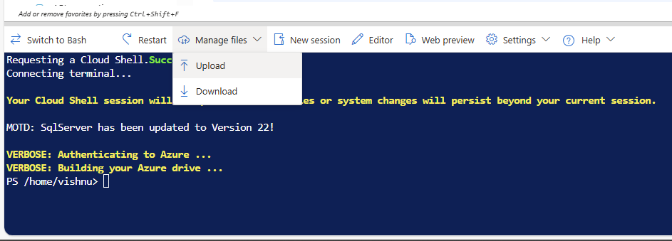
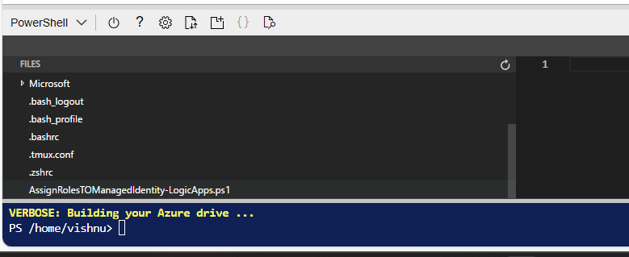

Once the script successfully runs, you will have assigned all the
necessary roles to the managed identity of your Logic app.

Now let’s work on getting your Logic app ready to run.

Before we run your Logic app, let’s provide values for your Logic app’s
required run parameters.

18. The **servicePrincipalId** is the **objectId** of the non-gallery
    SCIM app you created in the [previous section](#_Set_up_your).

19. Enter your SCIM endpoint.

20. Enter your SCIM bearer token.

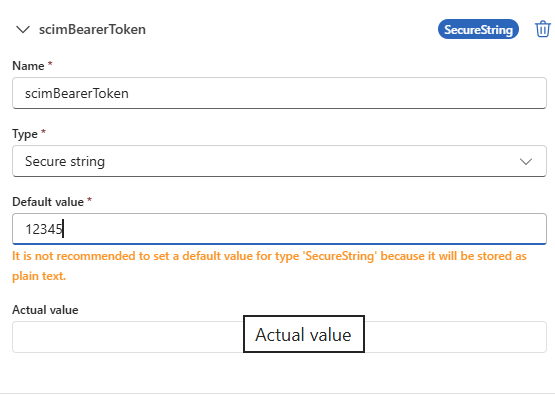

21. Under **templateId**, enter **scim** as the **Default value**.

22. Under **testUserDomain**, enter a verified domain that belongs to
    your tenant. This domain will be used to create test users in Entra
    ID and provision them to your SCIM endpoint as part of the automated
    tests that the Logic app template will run. *Note: A Logic app
    template that successfully completes all tests will clean up any
    test users that were created during that run. If the Logic app
    template does not complete a full, clean run, test users may not be
    cleaned up. For example, stubs of the test user accounts will remain
    in your tenant if the Logic app template fails the Delete User tests
    or if you choose to interrupt the Logic app template before it has
    the chance to complete delete operations.*

23. Under defaultUserProperties give the different sets of user
    Properties values to test. The Logic App takes one choose one set of
    the defaultUserProperties to create User and another set for
    updating User. Selection is random based on no. of sets.

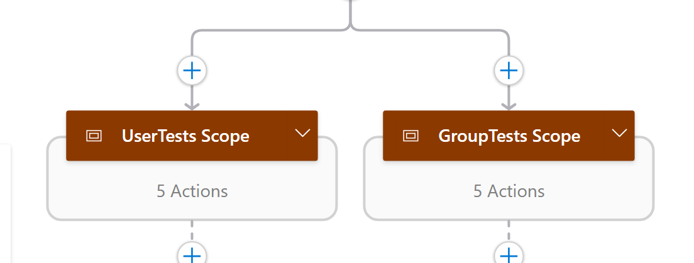

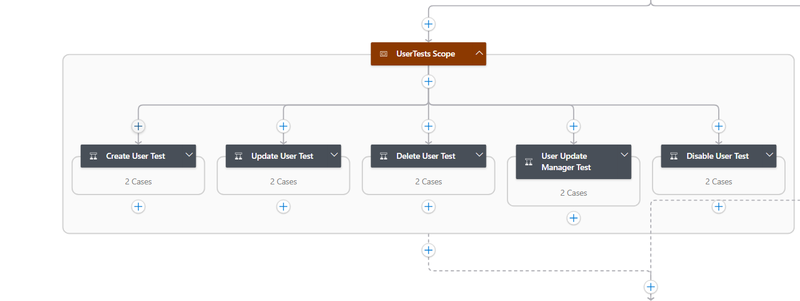

**  **

24. **EnabledTests** can take one of the below values. We support
    running all tests in parallel, running individual tests, or running
    tests related to only users or only groups. ***Only one value should
    be provided.***

> "All",

                    "UserTests",

                    "GroupTests",

                    "Create_User_Test",

                    "Update_User_Test",

                    "Delete_User_Test",

                    "User_Disable_Test",

                    "User_Update_Manager_Test",

                    "Create_Group_Test",

                    "Update_Group_Test",

                    "Delete_Group_Test",

                    "Group_Update_Add_Member_Test",

                    "Group_Update_Remove_Member_Test"

25. You’re now ready to run the Logic app! Navigate to **Development
    Tools \> Logic app designer**, then select **Run**.

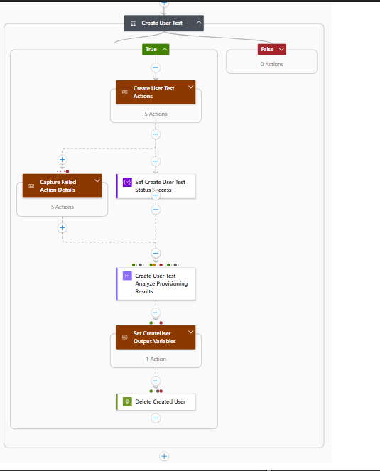

26. You can view logs of your runs in the **Runs history** blade. When
    clicking on an entry in **Runs history**, you check the final
    results of that entry, including the list of tests that were run,
    alongside status and any errors that may have come up.

*Tip:* More details about the run can be found by drilling down to the
test definition and checking the output. Here’s a sample of how the
output may look like:

*Another tip:* In the **Logic app designer** view, you can query for a
specific stage on the magnifying glass icon.

27. Debugging Logic App:

Check the Compose_Final_Results action to learn about the tests and
their results.

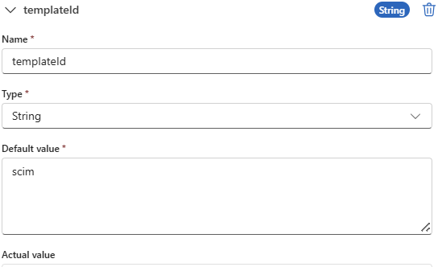

In Compose_Final_Results -\> Select 'Show raw Outputs’.

For each test, “testResult” shows the success / failure / skipped,
“provisioningErrorDetails” gives the Error information in case of
failure.

When we release the full self-service onboarding experience for
provisioning integrations, you will provide us with a **Run ID**
associated with a successful run of your Logic app (alongside details
such as the subscription and resource group that your Logic app is
associated with). Run IDs will be valid for a finite number of days,
during which we will review your submission and work on deploying your
provisioning integration to the Microsoft Entra app gallery. You will be
given access to this experience when it releases to Private Preview in
CY2026.

# Provide feedback

Once you get a chance to test the pilot, please fill out the following
feedback form: [Feedback Form for Self-Service Validation of
Provisioning Integrations (Pilot) – Fill out
form](https://forms.microsoft.com/Pages/ResponsePage.aspx?id=v4j5cvGGr0GRqy180BHbR1xPIYfdXw5FhHBIH8BxY9ZUNTJTRkc0SDUxOTdHSFk5UEZQVkVZRjhTMy4u)

In the form, you may specify whether you are interested in participating
in a follow-up feedback session with the Entra App Provisioning feature
team. In this feedback session, we would ask you more questions about
your experience.

We’re excited to hear more from you! Thank you for participating in our
pilot—your insights help us make Microsoft Entra ID better.

# Appendix

## Script for assigning permissions to your Logic app

Refer : https://github.com/AzureAD/SCIMReferenceCode/blob/55e7524466df913e426ad06918b3de5676b1ac24/Microsoft.SCIM.LogicAppValidationTemplate/AssignRolesTOManagedIdentity-LogicApps%201.ps1
