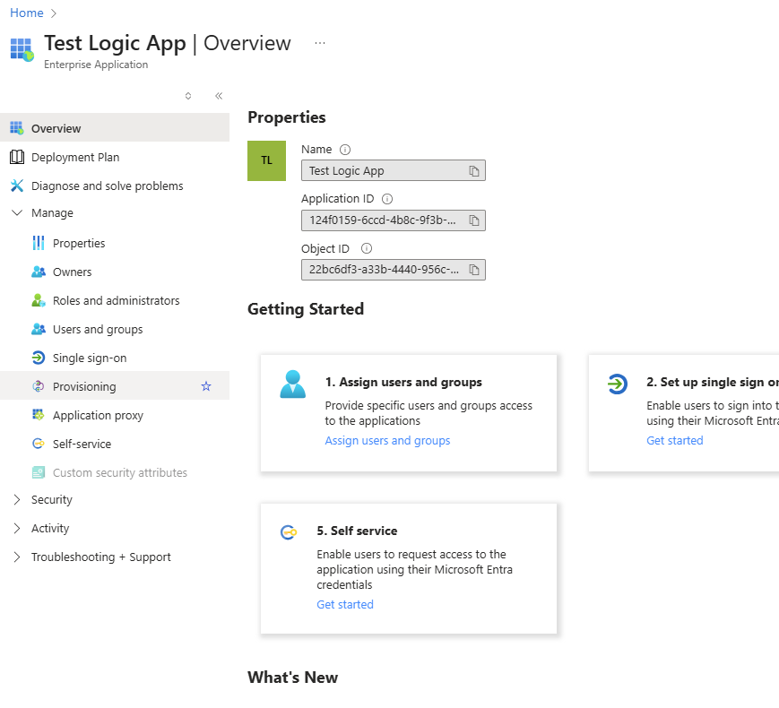
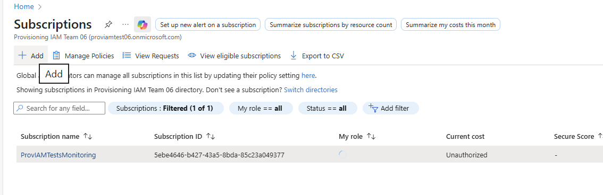
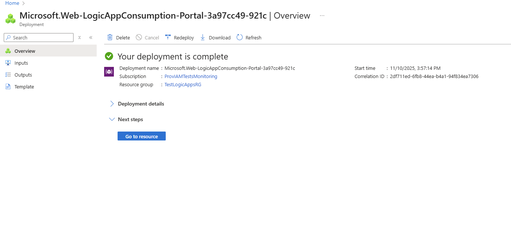
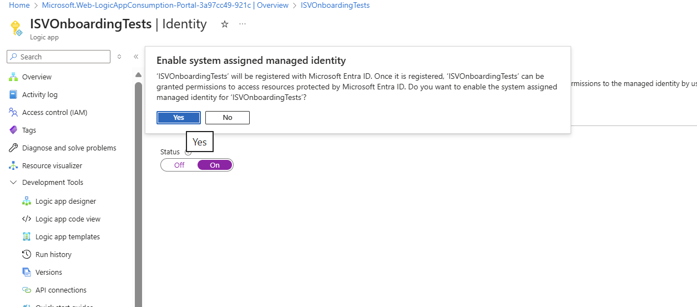
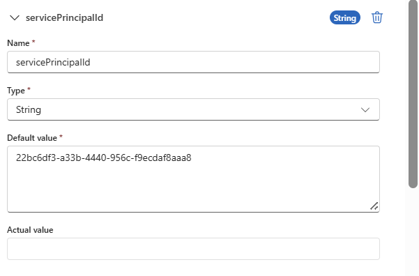
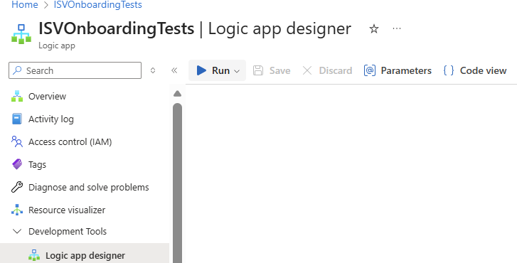
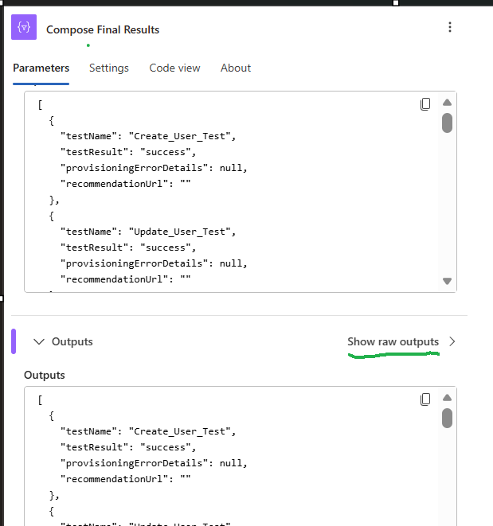

[Pilot] Self-Service Validation of Your Provisioning Integration with Azure Logic apps

# Overview

Welcome to the pilot for self-service validation of your provisioning integration with Azure Logic apps!

The Entra App Provisioning and Single Sign-On teams are currently working on building a revamped onboarding experience where ISVs can self-service onboard their provisioning or SSO integrations to the Microsoft Entra app gallery. This will enable you to bring your application into the Microsoft ecosystem faster and more efficiently than ever before.

The self-service onboarding experience will consist of multiple components:

A process to self-service validate that your provisioning integration is ready to onboard to the Microsoft Entra app gallery via a provided Azure Logic app template

A process to self-service validate that your SSO integration is ready to onboard to the Microsoft Entra app gallery via a browser extension

An intake form in the Entra portal where you can submit a publishing request for your SSO and/or provisioning application

This document walks you through #1, the process of self-service validating that your provisioning integration is ready to onboard to the Microsoft Entra app gallery. We are seeking your feedback on the validation experience, including what you enjoy and what we can improve.

## Disclaimer

This feature is currently in PREVIEW. This information relates to a pre-release product that may be substantially modified before it's released. Microsoft makes no warranties, expressed or implied, with respect to the information provided here.

## Support for preview

Microsoft Premier support will not provide support during the pilot. If you have questions or feedback to provide, you may reach out to the feature team managing this pilot at aaduserprovisioning@microsoft.com.

# Onboarding requirements

Technical requirements

For your application to be eligible to onboard to the Microsoft Entra app gallery, your provisioning integration must meet the following requirements:

Support a SCIM 2.0 user or group endpoint (only one is required, but supporting both a user and group endpoint is recommended)

Support the OAuth 2.0 Client Credentials grant as your primary authentication method

Note: Client Credentials is not required to participate in this pilot (i.e. you will be able to test the Logic app template using a bearer token). However, Client Credentials will be required to onboard to the Microsoft Entra app gallery

Currently, Client Credentials is the only authentication method we support for requests to onboard new provisioning integrations to the Microsoft Entra app gallery

Support updating multiple group memberships with a single PATCH request

Support at least 25 requests per second per tenant to ensure that users and groups can be provisioned and deprovisioned without delay

Your SCIM endpoint does not require features that Microsoft does not support today. Examples of features that the non-gallery SCIM app does not currently support:

Verbose PATCH calls

Support for batching calls (i.e. including multiple add operations in the same PATCH call)

Rate limiting

Validation requirements

This document provides you with instructions on how to self-service validate your application, so that it is ready to onboard to the Microsoft Entra app gallery. Once you complete the instructions in this document, you will have completed the following pre-requisites:

You should have set up a non-gallery SCIM app with a successful sync. This step requires:

A SCIM endpoint. If you need guidance on how to develop a SCIM endpoint, you can refer to our public documentation: https://learn.microsoft.com/entra/identity/app-provisioning/use-scim-to-provision-users-and-groups

An Entra ID tenant. If you don’t already have one, you can follow the instructions here to create one: https://learn.microsoft.com/entra/identity-platform/quickstart-create-new-tenant

You must have at least an Application Administrator role in the Entra ID tenant.

If your app will support only group provisioning, an Entra ID Premium P1 license is required for group-only provisioning to function (a P1 license is not required if “Provision all” is selected). A trial license will work. Note: If you have an M365 E3 or E5 license, Entra Premium is included as part of those license packages.

You should complete a successful run of our Logic app validation template, with no errors returned. This step requires:

In the same tenant where your non-gallery SCIM app is hosted, an Azure subscription for Logic app testing. The Logic app template functions on a consumption model, meaning that you will likely incur a small monetary cost as a result of running the Logic app. This cost is expected to be small (less than 10 USD per month on an Azure pay-as-you-go subscription).

You must have permissions to create a Logic app under the appropriate subscription and resource group. This will require at least a Logic app contributor role, but more permissions may be required depending on whether you also need to create a subscription and resource group.

Publishing requirements

While not required to participate in this pilot, the following is required to complete the self-service publishing experience once it becomes available for Private Preview in CY2026:

Your tenant must be registered as a partner in Microsoft Partner Center and enrolled in the Microsoft AI Cloud Partner program.

You must have documentation for your SCIM endpoint ready to publish. Once Private Preview starts, a documentation template will be available for you to use.

End customers should be able to access documentation about your SCIM endpoint on both your website and the Microsoft Learn website.

Please provide us with engineering and support contacts for us to refer end customers to once your application is published to the Microsoft Entra app gallery.

# Set up your non-gallery SCIM app

As mentioned in the Requirements section, before you validate your provisioning integration, you must set up a non-gallery SCIM app with your desired configuration and start a successful sync with that app. This section describes how to do so.

## Requirements

In the Onboarding requirements section, review the Validation requirements list to ensure that you have everything you need to set up a non-gallery SCIM app.

## Instructions

Sign in to the Entra portal at entra.microsoft.com.

Select Enterprise applications > New application > Create your own application.

Enter the name of your app, integration options, and click Create.

Take note of the Object ID (this will be referred to as servicePrincipalID in the logic App).

Set Provisioning Mode to Automatic, enter your bearer token details, and select Test Connection.

Create a provisioning job by creating connection and set up schema by navigating to Provisioning > Mappings > Provision Users. For more details on how to customize schema, you can check out our public documentation here: Tutorial - Customize Microsoft Entra attribute mappings in Application Provisioning - Microsoft Entra ID | Microsoft Learn

In the Overview page, select Start Provisioning to start a provisioning job. If the provisioning job commences without errors, you are ready to move on to the next section.

Optional: Once you’ve successfully started a provisioning job, submit an allow list request for faster sync cycles via this form: Allow List for Self-Service Validation of Provisioning Integration (Pilot) – Fill out form. The Entra App Provisioning team will then work on allow listing your tenant and provisioning job. Once complete, you will have access to sync cycles that run more frequently than the standard 40-minute sync cycle, allowing you to test and iterate upon your provisioning integration quickly.

# Set up a Logic app for running automated tests

Once you have set up a non-gallery SCIM app and started the sync, you will use our provided Logic app template to validate your provisioning integration and ensure that it is ready to publish to the Microsoft Entra app gallery.

Once we release the full private preview for the full onboarding and publishing experience, a successful run of the Logic app template will allow you to submit a publishing request for your provisioning integration, after which we will review and deploy your app.

## Requirements

In the Onboarding requirements section, review the Validation requirements list to ensure that you have everything you need to set up a Logic app.

## Instructions

Sign in to the Azure portal at https://portal.azure.com. You should use the same tenant as the one where you set up your non-gallery SCIM app.

Use the searchbar to navigate to the Subscriptions blade.

Select the appropriate Azure subscription and create a resource group. This is the subscription and resource group that your Logic app will be attached to.

Use the searchbar to navigate to the Logic apps blade.

Select Add > Multi-tenant (consumption). Note: The Logic app functioning on a consumption model means that you may be billed on your Azure description depending on level of usage. The amount is expected to be small—see the Onboarding requirements section for more details, under Validation requirements.

Configure the settings of your Logic app as desired. Once you are done, click Review + create.

Once the Logic app finishes deploying, open the Logic app.

Download the logicAppTemplate.json file from the Microsoft.SCIM.LogicAppValidationTemplate folder of our GitHub repository: https://github.com/AzureAD/SCIMReferenceCode/tree/master/Microsoft.SCIM.LogicAppValidationTemplate (copy/paste this URL into your browser). Note: The folder includes a README.md file that lists out the various tests that the Logic app will run. This may be helpful for your reference.

In the Logic app, select Development Tools > Logic app code view. Copy/paste the code from the template in the previous step and click Save. The Logic app designer view should then update with the various test cases that our template will automatically run for you.

Next, we will enable system-assigned managed identity for secure resource access. Select Settings > Identity.

Set the Status in the System assigned tab to On. Select Yes in the confirmation dialog that pops up.

Select Save.

Take note of the object ID of the managed identity. You will need this object ID for the script that you will run in a few steps.

Now let’s work on granting the owner role to the Logic app. Select Azure role assignments.

In the Azure role assignments page, click on Add role assignment and select the Owner role.

Once the owner role has been granted to the Logic app, you can now work on assigning the proper permissions to the Logic app so that it can invoke various Graph queries as part of the automated tests it will run (the Logic app will create, update, and delete users and groups, query provisioning logs, etc.).

You may choose to use Azure CLI or PowerShell for the following steps.

Go to the sample script provided in the appendix of this document. Copy the script for your records, and update the value of the $logicAppManagedId field with the object ID of your Logic app’s managed identity.

Run the script using the command-line interface of your choice. If using a UI like Azure Cloud Shell that provides you with an option to upload a file, you may opt to copy the script into a file, upload the file, then run the script.

How to upload and run a script using Azure Cloud Shell

Once the script successfully runs, you will have assigned all the necessary roles to the managed identity of your Logic app.

Now let’s work on getting your Logic app ready to run.

Before we run your Logic app, let’s provide values for your Logic app’s required run parameters.

The servicePrincipalId is the objectId of the non-gallery SCIM app you created in the previous section.

Enter your SCIM endpoint.

Enter your SCIM bearer token.

Under templateId, enter scim as the Default value.

Under testUserDomain, enter a verified domain that belongs to your tenant. This domain will be used to create test users in Entra ID and provision them to your SCIM endpoint as part of the automated tests that the Logic app template will run. Note: A Logic app template that successfully completes all tests will clean up any test users that were created during that run. If the Logic app template does not complete a full, clean run, test users may not be cleaned up. For example, stubs of the test user accounts will remain in your tenant if the Logic app template fails the Delete User tests or if you choose to interrupt the Logic app template before it has the chance to complete delete operations.

Under defaultUserProperties give the different sets of user Properties values to test. The Logic App takes one choose one set of the defaultUserProperties to create User and another set for updating User. Selection is random based on no. of sets.

EnabledTests can take one of the below values. We support running all tests in parallel, running individual tests, or running tests related to only users or only groups. Only one value should be provided.

"All",

"UserTests",

"GroupTests",

"Create_User_Test",

"Update_User_Test",

"Delete_User_Test",

"User_Disable_Test",

"User_Update_Manager_Test",

"Create_Group_Test",

"Update_Group_Test",

"Delete_Group_Test",

"Group_Update_Add_Member_Test",

"Group_Update_Remove_Member_Test"

You’re now ready to run the Logic app! Navigate to Development Tools > Logic app designer, then select Run.

You can view logs of your runs in the Runs history blade. When clicking on an entry in Runs history, you check the final results of that entry, including the list of tests that were run, alongside status and any errors that may have come up.

Tip: More details about the run can be found by drilling down to the test definition and checking the output. Here’s a sample of how the output may look like:

Another tip: In the Logic app designer view, you can query for a specific stage on the magnifying glass icon.

Debugging Logic App:

Check the Compose_Final_Results action to learn about the tests and their results.

In Compose_Final_Results -> Select 'Show raw Outputs’.

For each test, “testResult” shows the success / failure / skipped,	 “provisioningErrorDetails” gives the Error information in case of failure.

When we release the full self-service onboarding experience for provisioning integrations, you will provide us with a Run ID associated with a successful run of your Logic app (alongside details such as the subscription and resource group that your Logic app is associated with). Run IDs will be valid for a finite number of days, during which we will review your submission and work on deploying your provisioning integration to the Microsoft Entra app gallery. You will be given access to this experience when it releases to Private Preview in CY2026.

# Provide feedback

Once you get a chance to test the pilot, please fill out the following feedback form: Feedback Form for Self-Service Validation of Provisioning Integrations (Pilot) – Fill out form

In the form, you may specify whether you are interested in participating in a follow-up feedback session with the Entra App Provisioning feature team. In this feedback session, we would ask you more questions about your experience.

We’re excited to hear more from you! Thank you for participating in our pilot—your insights help us make Microsoft Entra ID better.

# Appendix

## Script for assigning permissions to your Logic app

Refer https://github.com/AzureAD/SCIMReferenceCode/blob/55e7524466df913e426ad06918b3de5676b1ac24/Microsoft.SCIM.LogicAppValidationTemplate/AssignRolesTOManagedIdentity-LogicApps%201.ps1 
