\[Pilot\] Self\-Service Validation of Your Provisioning Integration with Azure Logic apps

# Overview

Welcome to the pilot for __self\-service validation of your provisioning integration with Azure Logic apps__\!

The Entra App Provisioning and Single Sign\-On teams are currently working on building a revamped onboarding experience where ISVs can self\-service onboard their provisioning or SSO integrations to the Microsoft Entra app gallery\. This will enable you to bring your application into the Microsoft ecosystem faster and more efficiently than ever before\. 

The self\-service onboarding experience will consist of multiple components:

1. A process to self\-service validate that your provisioning integration is ready to onboard to the Microsoft Entra app gallery via a provided Azure Logic app template
2. A process to self\-service validate that your SSO integration is ready to onboard to the Microsoft Entra app gallery via a browser extension
3. An intake form in the Entra portal where you can submit a publishing request for your SSO and/or provisioning application

This document walks you through __\#1__, the process of self\-service validating that your provisioning integration is ready to onboard to the Microsoft Entra app gallery\. We are seeking your feedback on the validation experience, including what you enjoy and what we can improve\.

## Disclaimer

This feature is currently in PREVIEW\. This information relates to a pre\-release product that may be substantially modified before it's released\. Microsoft makes no warranties, expressed or implied, with respect to the information provided here\.

## Support for preview

Microsoft Premier support will not provide support during the pilot\. If you have questions or feedback to provide, you may reach out to the feature team managing this pilot at [aaduserprovisioning@microsoft\.com](mailto:aaduserprovisioning@microsoft.com)\.

# Onboarding requirements

*Technical requirements*

For your application to be eligible to onboard to the Microsoft Entra app gallery, your provisioning integration must meet the following requirements:

- Support a SCIM 2\.0 user or group endpoint \(only one is required, but supporting both a user and group endpoint is recommended\)
- Support the OAuth 2\.0 Client Credentials grant as your primary authentication method
	- Note: Client Credentials is not required to participate in this pilot \(i\.e\. you need to use __*long lived*  bearer token__ to test the Logic app\)\. However, Client Credentials will be required to onboard to the Microsoft Entra app gallery
	- Currently, Client Credentials is the only authentication method we support for requests to onboard new provisioning integrations to the Microsoft Entra app gallery
	- Requirements for Client Credentials: An admin portal where a customer can generate a client ID and secret
	- Best practices: Support the ability to rotate secrets and delete old secrets
- Support updating multiple group memberships with a single PATCH request
- Support at least 25 requests per second per tenant to ensure that users and groups can be provisioned and deprovisioned without delay
- On querying for a nonexistent user with filter query, your server should respond with success and empty results\. \(on contrast with bad request as we see in some SCIM implementation\)
- Your SCIM endpoint does not require features that Microsoft does not support today\. Examples of features that the non\-gallery SCIM app does not currently support:
	- Verbose PATCH calls
	- Support for batching calls \(i\.e\. including multiple add operations in the same PATCH call\)
	- Rate limiting

*Validation requirements*

This document provides you with instructions on how to self\-service validate your application, so that it is ready to onboard to the Microsoft Entra app gallery\. Once you complete the instructions in this document, you will have completed the following pre\-requisites:

- You should have set up a non\-gallery SCIM app with a successful sync\. This step requires:
	- A SCIM endpoint\. If you need guidance on how to develop a SCIM endpoint, you can refer to our public documentation: [https://learn\.microsoft\.com/entra/identity/app\-provisioning/use\-scim\-to\-provision\-users\-and\-groups](https://learn.microsoft.com/entra/identity/app-provisioning/use-scim-to-provision-users-and-groups)
	- An Entra ID tenant\. If you don’t already have one, you can follow the instructions here to create one: [https://learn\.microsoft\.com/entra/identity\-platform/quickstart\-create\-new\-tenant](https://learn.microsoft.com/entra/identity-platform/quickstart-create-new-tenant) 
	- You must have at least an __Application Administrator__ role in the Entra ID tenant\.
	- If your app will support only group provisioning, an [Entra ID Premium P1 license](https://learn.microsoft.com/entra/fundamentals/licensing) is required for group\-only provisioning to function \(a P1 license is not required if “Provision all” is selected\)\. A trial license will work\. *Note: If you have an *[*M365 E3 or E5 license*](https://www.microsoft.com/microsoft-365/enterprise/microsoft-365-plans-and-pricing)*, Entra Premium is included as part of those license packages\.*
- You should complete a successful run of our Logic app validation template, with no errors returned\. This step requires:
	- In the same tenant where your non\-gallery SCIM app is hosted, an Azure subscription for Logic app testing\. The Logic app template functions on a [consumption model](https://learn.microsoft.com/azure/logic-apps/single-tenant-overview-compare), meaning that you will likely incur a small monetary cost as a result of running the Logic app\. This cost is expected to be small \(less than 10 USD per month on an [Azure pay\-as\-you\-go subscription](https://azure.microsoft.com/pricing/purchase-options/azure-account/search?icid=hybrid-cloud&ef_id=_k_CjwKCAiA8vXIBhAtEiwAf3B-gwGo45BSp9MkHu1_SsZHPGytGsYgUoGgKhwiVKvh4pCybuz62bqCnhoCYlgQAvD_BwE_k_&OCID=AIDcmm5edswduu_SEM__k_CjwKCAiA8vXIBhAtEiwAf3B-gwGo45BSp9MkHu1_SsZHPGytGsYgUoGgKhwiVKvh4pCybuz62bqCnhoCYlgQAvD_BwE_k_&gad_source=1&gad_campaignid=21496728177&gbraid=0AAAAADcJh_siQ5FaD4VnPUpZunMKSJ2sy&gclid=CjwKCAiA8vXIBhAtEiwAf3B-gwGo45BSp9MkHu1_SsZHPGytGsYgUoGgKhwiVKvh4pCybuz62bqCnhoCYlgQAvD_BwE)\)\.
	- You must have permissions to create a Logic app under the appropriate subscription and resource group\. This will require at least a [Logic app contributor](https://learn.microsoft.com/azure/logic-apps/logic-apps-securing-a-logic-app?tabs=azure-portal) role, but more permissions may be required depending on whether you also need to create a subscription and resource group\.
	- If the Get API call do not have any results, the SCIM server should return 0 results but not a Bad Request\.

*Publishing requirements*

While not required to participate in this pilot, the following is required to complete the self\-service publishing experience once it becomes available for Private Preview in CY2026:

- Your tenant must be registered as a partner in Microsoft Partner Center and enrolled in the Microsoft AI Cloud Partner program\.
- You must have documentation for your SCIM endpoint ready to publish\. Once Private Preview starts, a documentation template will be available for you to use\.
	- End customers should be able to access documentation about your SCIM endpoint on both your website and the Microsoft Learn website\.
- Please provide us with engineering and support contacts for us to refer end customers to once your application is published to the Microsoft Entra app gallery\.

# Two Ways to Validate Your Integration

You can validate your SCIM provisioning integration using either of two methods:

__Method A: AI Agent \(Automated\)__

__Method B: Manual Setup__

__What__

Use the scim\-onboarding\.agent\.md file with an AI tool — the agent automates the entire process conversationally

Follow step\-by\-step instructions in this document to manually create resources, deploy the Logic App, configure parameters, and run tests

__Time__

30–60 minutes \(guided, mostly automated\)

1–3 hours \(manual steps\)

__Skills needed__

Basic familiarity with an AI chat tool

Azure Portal, Entra Portal, PowerShell/CLI

__Best for__

Faster setup, automated debugging and re\-runs

Full control over every step

__Both methods produce the same result:__ a validated Logic App run that you can submit to Microsoft\.

Choose your preferred method: \- __Method A__ — Continue reading the sections below for manual step\-by\-step instructions \- __Method B__ — Jump to the section __“Alternative: Automated Setup Using the SCIM Onboarding Agent”__ later in this document

# Method A: Agent\-Automated Setup

The __SCIM Onboarding Agent__ is an AI\-powered agent that automates the entire validation workflow\. Instead of following 28 manual steps, you have a conversation with the agent — it creates all Azure and Entra resources, deploys the Logic App, runs tests, diagnoses failures, and generates submission artifacts\.

## What the Agent Does

The agent handles the entire validation process through a simple conversation\. Here’s what happens at a high level:

1. __Asks you a few questions__ — Your SCIM endpoint URL, bearer token, and authentication method, confirming Schema, Input parameters required for testing\.
2. __Sets up everything automatically__ — Creates the Entra app, Azure resources, Logic App, assigning permissions — all the manual portal steps
3. __Runs the tests__ — Triggers all validation tests and monitors progress
4. __Fixes problems__ — If tests fail due to known issues, the agent fixes them and re\-runs automatically, or provide recommendations for fixes in scim server
5. __Gives you results__ — Shows which tests passed/failed and generates the validation results that need to be submitted to Microsoft

You don’t need to navigate any portal or run any script — just answer the agent’s questions and approve the commands it runs\.

## Prerequisites

Before using the agent, ensure you have:

1. __VS Code__ installed — [Download VS Code](https://code.visualstudio.com/)
2. __Azure CLI__ installed and logged in — [Install Azure CLI](https://aka.ms/installazurecli)

- az login

1. __Application Administrator__ role in your Entra ID tenant
2. __Azure subscription__ with Logic App Contributor permissions
3. Your __SCIM endpoint URL__ \(e\.g\., https://scim\.example\.com/v2\)
4. A __long\-lived bearer token__ for your SCIM endpoint
5. The __scim\-onboarding\.agent\.md__ file \(provided with this package\)

## Setup Instructions

### Option A: Using Cline \(VS Code Extension\)

#### Setting Up Your AI Agent

#### The SCIM onboarding agent is a single instructions file that any AI coding agent can execute\. You bring your own agent host and model — we provide the agent\.

#### __Step 1:__ Choose an AI agent host

#### Use any AI coding agent you already have, such as VS Code with GitHub Copilot, Cursor, Windsurf, Cline, Claude Code, or similar\.

#### __Step 2:__ Choose an AI model

#### The agent performs multi\-step reasoning — collecting inputs, creating Azure resources, running tests, and debugging failures across Logic App workflows\. Use a capable model:

Provider  *        *

Minimum recommended model

Anthropic *     *

Claude Opus 4 or later    

OpenAI    *       *

GPT\-4\.1 or later          

Google    *       *

Gemini 2\.5 Pro or later

#### Smaller or older models may skip required inputs, fail to drill into errors, or retry failures without diagnosing the root cause\.

#### __Step 3: \[Note: __these are just recommendation, at the agent is just a prompt file, feel free to load it anyway you can\.\] 

#### Load the agent 

####  1\. Create a project folder \(e\.g\., C:\\scim\-validation\)

####  2\. Inside that folder, create the subfolder \.github\\agents\\

####  3\. Place scim\-onboarding\.agent\.md inside \.github\\agents\\

#### Your folder should look like:

####  C:\\scim\-validation\\

####    └── \.github\\

####        └── agents\\

####            └── scim\-onboarding\.agent\.md

####  1\. Open this folder in your agent host:

####  \- VS Code with GitHub Copilot — open the folder in VS Code\. Copilot auto\-discovers agents from \.github/agents/\. Invoke with @scim\-onboarding in Copilot Chat\.

####  \- Cline / Cursor / Windsurf — open the folder, then load scim\-onboarding\.agent\.md as a system prompt or custom instructions file\.

####  \- Claude Code — open the folder, then reference as context: @scim\-onboarding\.agent\.md

####  \- Other hosts — copy the file contents into your agent's system prompt or instructions field\.

#### __Step 4:__ Start

#### Send this message to the agent:

####  Validate my SCIM integration for Entra app gallery onboarding

#### The agent will ask for your SCIM endpoint, bearer token, OAuth credentials \(if applicable\), and guide you through the entire validation workflow\.

When the agent requests to run commands, review and approve them

#### Step 5: Interact with the Agent

The agent will guide you through the process conversationally\. Here’s what to expect:

Agent: What is your SCIM endpoint URL?  
You:   https://api\.myapp\.com/scim/v2  
  
Agent: What is your bearer token?  
You:   eyJhbGciOiJSUzI1NiIs\.\.\.  
  
Agent: Does your SCIM endpoint use OAuth client credentials or a static bearer token?  
You:   Static bearer token  
  
Agent: ✅ Azure CLI — Logged in as admin@contoso\.onmicrosoft\.com  
       ✅ SCIM endpoint — HTTP 200  
       ✅ /Users — Supported  
       ✅ /Groups — Supported  
         
       I'll now create the Azure resources and deploy the Logic App\.\.\.  
  
\[Agent automatically creates everything and runs tests\]  
  
Agent: ✅ VALIDATION RESULTS  
       Create\_User\_Test: SUCCESS  
       Update\_User\_Test: SUCCESS  
       \.\.\.

### Option B: Using GitHub Copilot Chat \(VS Code\)

If you have __GitHub Copilot__ with agent mode enabled:

#### Step 1: Set Up

1. Ensure GitHub Copilot and Copilot Chat are installed in VS Code
2. Place the __scim\-onboarding\.agent\.md__ file in your project folder
3. Open the folder in VS Code

#### Step 2: Run

1. Open __Copilot Chat__ \(Ctrl\+Shift\+I or click the Copilot icon\)
2. Switch to __Agent mode__ \(click the mode selector at the top of the chat panel\)
3. Reference the agent file and start:

@workspace Use the instructions in scim\-onboarding\.agent\.md to validate my SCIM provisioning integration\. Start the full validation workflow\.

1. Follow the prompts and approve command executions as requested

### Option C: Using Any AI Agent That Supports Tool Use

The scim\-onboarding\.agent\.md file is a standard agent instruction file\. It can be used with any AI agent platform that supports: \- Reading/writing files \- Executing CLI commands \- Conversational interaction

Simply provide the agent file as system instructions and ensure the agent has access to a terminal with Azure CLI installed and authenticated\.

## Questions the Agent Will Ask You

The agent will ask you these questions one at a time during the conversation\. Have the answers ready before you start\.

### Question 1: SCIM Endpoint URL

“What is your SCIM endpoint URL?”

Provide the base URL of your SCIM 2\.0 endpoint\. This is the URL that Microsoft Entra ID will send provisioning requests to\.

__Example:__ https://api\.myapp\.com/scim/v2

__Important:__ Do NOT include the ?aadOptscim062020 feature flag in this URL\. If your endpoint requires this flag, it should only be configured in the Entra portal’s Tenant URL field, not here\.

### Question 2: Bearer Token

“What is your bearer token for the SCIM endpoint?”

Provide a long\-lived bearer token that the Logic App will use to authenticate against your SCIM endpoint\.

__Important:__ The token must remain valid for at least 2 hours \(the test run can take 60–90 minutes\)\. If your token is a short\-lived JWT, the tests will fail partway through\. Use a token that lasts at least 24 hours\.

### Question 3: Authentication Method

“Does your SCIM endpoint use OAuth client credentials or a static bearer token?”

- __Static bearer token__ — Most common for pilot testing\. The agent will note that Validate\_Credentials\_Test will be skipped \(this is expected\)\.
- __OAuth client credentials__ — If you choose this, the agent will ask 4 follow\-up questions:
	- __Client ID__ — Your OAuth application’s client ID
	- __Client Secret__ — Your OAuth application’s client secret
	- __Token Endpoint URL__ — e\.g\., https://auth\.myapp\.com/oauth/token
	- __OAuth Scope__ — The scope required for SCIM access \(leave empty if not applicable\)

### Question 4: Azure Subscription Selection

“Which Azure subscription would you like to use?”

The agent will list your available Azure subscriptions\. Pick the one where the Logic App resources will be created\. If you only have one subscription, the agent selects it automatically\.

### Question 5: Attribute Mapping Review

“Would you like to keep these default attribute mappings, or do you want to customize them in the Entra portal first?”

After creating the SCIM app, the agent __fetches the default attribute mappings__ that Microsoft Entra automatically created and displays them to you in a table:

USER ATTRIBUTE MAPPINGS:  
| \#  | Entra ID Source             | SCIM Target Attribute  |  
|\-\-\-\-|\-\-\-\-\-\-\-\-\-\-\-\-\-\-\-\-\-\-\-\-\-\-\-\-\-\-\-\-\-|\-\-\-\-\-\-\-\-\-\-\-\-\-\-\-\-\-\-\-\-\-\-\-\-|  
| 1  | userPrincipalName           | userName               |  
| 2  | Switch\(\[IsSoftDeleted\],\.\.\.\) | active                 |  
| 3  | displayName                 | displayName            |  
| 4  | surname                     | name\.familyName        |  
| 5  | givenName                   | name\.givenName         |  
| \.\. | \.\.\.                         | \.\.\.                    |

These are the defaults provided by Entra\. You then choose: \- __“Keep the default mappings — they look correct”__ — Use this if your SCIM server supports all the listed attributes\. \- __“I want to customize — let me go to the Entra portal”__ — The agent will give you portal instructions\. After you save your changes, come back and tell the agent you’re done\.

After you confirm \(either keeping defaults or after customizing\), the agent __fetches the mappings again__ and displays the final schema for one more confirmation: \- __“Yes, this is correct — proceed with testing”__ \- __“I want to make more changes — let me go back to the portal”__ \(loops back\) \- __“Reset to defaults”__

The agent will not start testing until you explicitly confirm the final schema\.

### Question 6: Attribute Value Restrictions

“Does your SCIM server have any restrictions on attribute values?”

The agent will first check your /Schemas endpoint for any canonicalValues restrictions it can detect automatically\. Then it asks you to confirm or add more\.

__Examples of restrictions:__ \- jobTitle must be one of: "Engineer", "Manager", "Director" \- department must be one of: "Engineering", "Sales", "Marketing" \- employeeType must be "Employee" or "Contractor"

If you have restrictions, tell the agent the exact allowed values\. It will configure the test user profiles to use valid values — otherwise the tests __will fail__ with schema validation errors\.

If you have no restrictions, say __“No restrictions”__\.

# Method B: Manual Setup

## Pre\-run: Setup

### Set up your non\-gallery SCIM app

As mentioned in the [Requirements section](#_Requirements), before you validate your provisioning integration, you must set up a non\-gallery SCIM app with your desired configuration and start a successful sync with that app\. This section describes how to do so\.

### Requirements

In the [Onboarding requirements section](#_Onboarding_Requirements), review the *Validation requirements* list to ensure that you have everything you need to set up a non\-gallery SCIM app\.

### Instructions

1. Sign in to the Entra portal at [entra\.microsoft\.com](https://entra.microsoft.com)\. 
2. Select __Enterprise applications > New application > Create your own application__\.

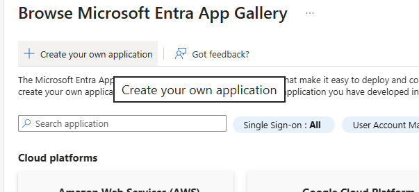

1. Enter the name of your app, integration options, and click __Create__\.

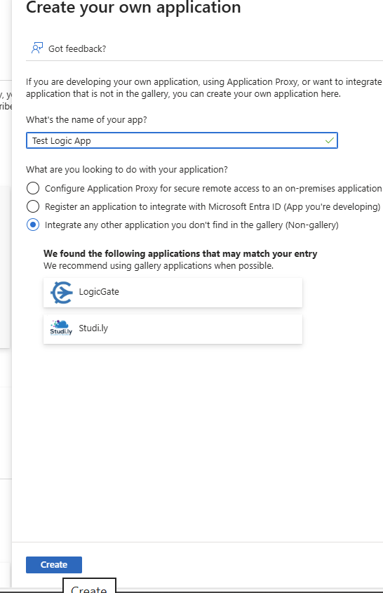

1. Take note of the __Object ID __\(this will be referred to as servicePrincipalID in the logic App\)\.

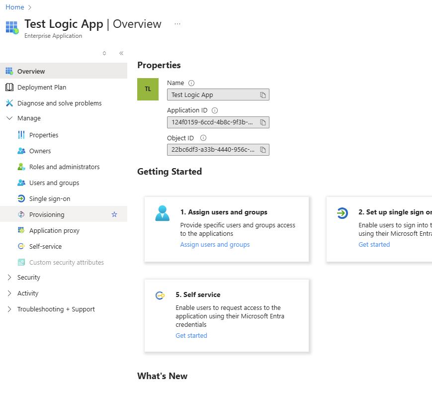

1. Set __Provisioning Mode__ to __Automatic__, enter your bearer token details, and select __Test Connection__\.

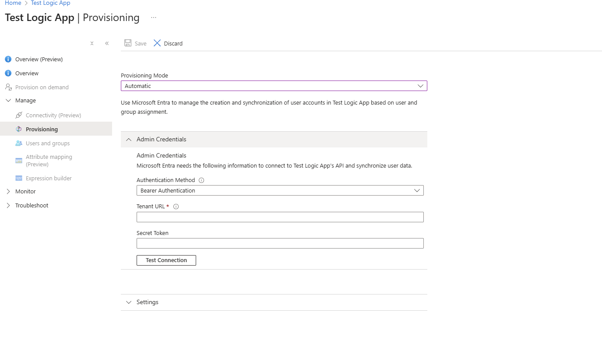

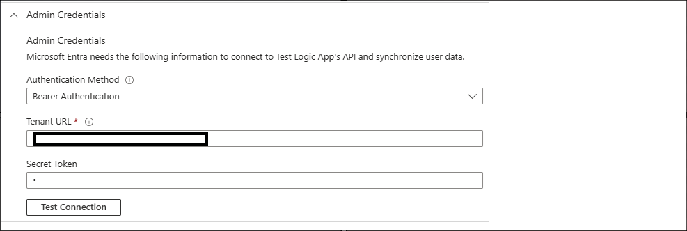

1. Create a provisioning job by creating connection and set up schema by navigating to __Provisioning > Mappings > Provision Users__\. For more details on how to customize schema, you can check out our public documentation here: [Tutorial \- Customize Microsoft Entra attribute mappings in Application Provisioning \- Microsoft Entra ID | Microsoft Learn](https://learn.microsoft.com/en-us/entra/identity/app-provisioning/customize-application-attributes)\.

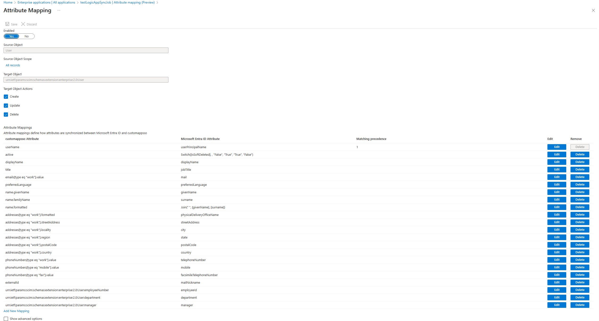

__Prune the schema__ with only attributes/mappings required and supported by the ISV\. Select the checkbox __Show Advanced Options\. __Then the __Edit attribute list__ link will be displayed\. Select the link and verify the attributes\. Update/delete the attributes depending on the schema supported by the ISV endpoint\.

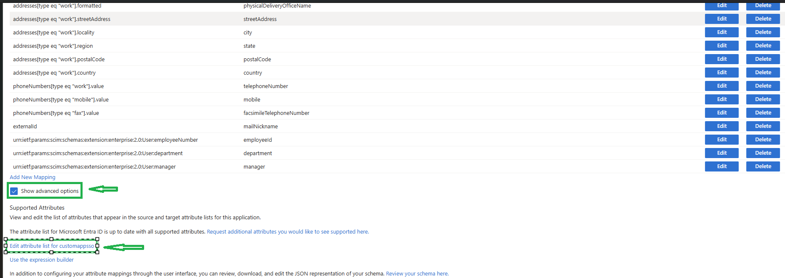

The schema can be exported by selecting “Review your schema here”\. Then select “Download” from the open schema editor\.

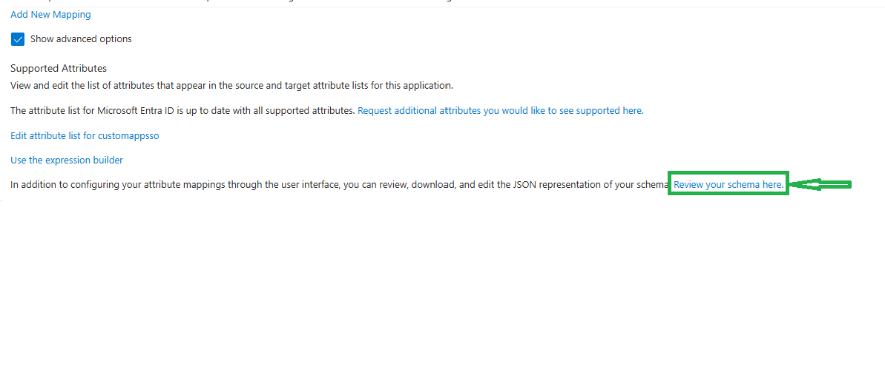

1. In the __Overview __page, select __Start Provisioning__ to start a provisioning job\. If the provisioning job commences without errors, you are ready to move on to the next section\.

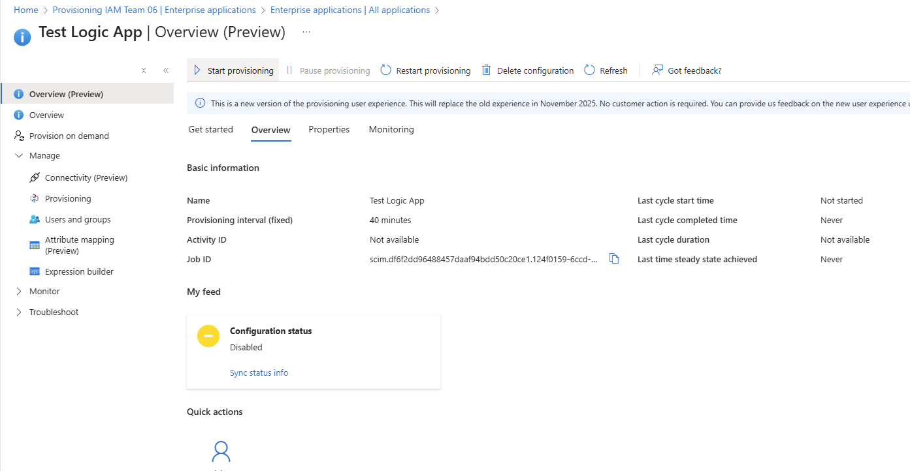

1. __Optional:__ Once you’ve successfully started a provisioning job, submit an allow list request for faster sync cycles via this form: [Allow List for Self\-Service Validation of Provisioning Integration \(Pilot\) – Fill out form](https://forms.microsoft.com/Pages/ResponsePage.aspx?id=v4j5cvGGr0GRqy180BHbR1xPIYfdXw5FhHBIH8BxY9ZUQ0w0UEczQTdLT1gzUTIyVzVNOUFHTjNGQS4u)\. The Entra App Provisioning team will then work on allow listing your tenant and provisioning job\. Once complete, you will have access to sync cycles that run more frequently than the standard 40\-minute sync cycle, allowing you to test and iterate upon your provisioning integration quickly\.

### Set up a Logic app for running automated tests

Once you have set up a non\-gallery SCIM app and started the sync, you will use our provided Logic app template to validate your provisioning integration and ensure that it is ready to publish to the Microsoft Entra app gallery\. Logic app runs user tests and group tests on ISVs behalf by using the non\-gallery SCIM app that you set up\. 

Once we release the full private preview for the full onboarding and publishing experience, a successful run of the Logic app template will allow you to submit a publishing request for your provisioning integration, after which we will review and deploy your app\.

### Requirements

In the [Onboarding requirements section](#_Onboarding_Requirements), review the *Validation requirements* list to ensure that you have everything you need to set up a Logic app\.

### Instructions

1. Sign in to the Azure portal at [https://portal\.azure\.com](https://portal.azure.com)\. You should use the same tenant as the one where you set up your non\-gallery SCIM app\.
2. Use the searchbar to navigate to the __Subscriptions__ blade\.

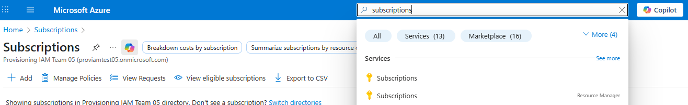

1. Select the appropriate Azure subscription and create a resource group\. This is the subscription and resource group that your Logic app will be attached to\.

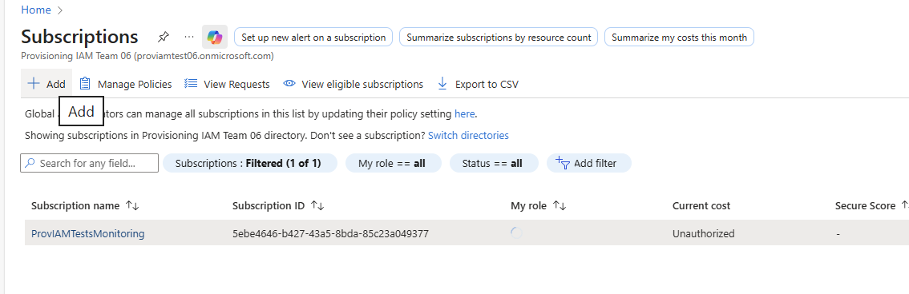

1. Use the searchbar to navigate to the __Logic app__s blade\. 
2. Select __Add > WorkFlow Service Plan\(Standard\)__\. *Note: The Logic app functioning on a Standard model means that you may be billed on your Azure description depending on level of usage\. The amount is expected to be small—see the *[*Onboarding requirements section*](#_Onboarding_Requirements)* for more details, under *Validation requirements*\.*

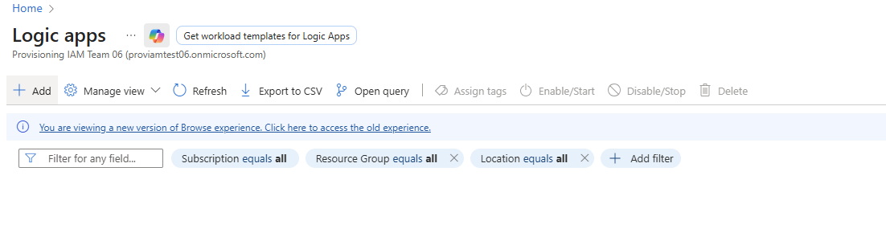

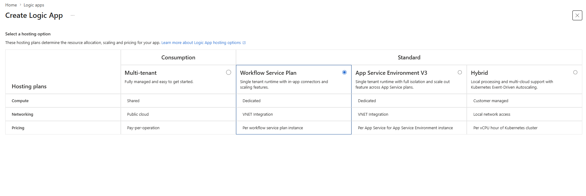

1. Provide Name , select the ResourceGroup created earlier\.

1. Got to “Storage” tab\. Change the “Blob service Diagnostics settings” to configure now and select the DefaultWorkspace\.

1. Keep them as it is for the rest of the settings\. Configure the settings of your Logic app as desired\. Once you are done, click __Review \+ create__\. 

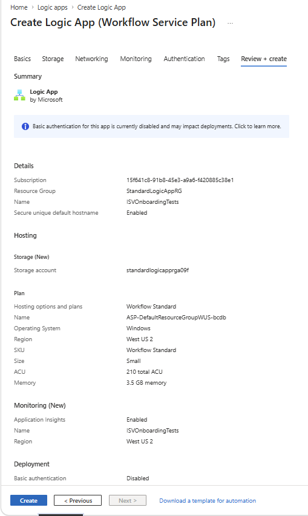

1. Once the Logic app finishes deploying, open the Logic app\.

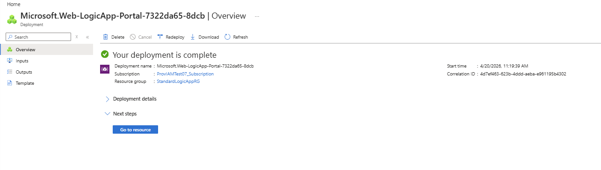

1. You may choose to use Azure CLI or PowerShell for the following steps. Download all files from the [**StandardLogicApp** folder](https://github.com/AzureAD/SCIMReferenceCode/tree/master/Microsoft.SCIM.LogicAppValidationTemplate/StandardLogicApp) of our GitHub repository (`Orchestrator_Workflow.json`, `Initialization_Workflow.json`, `UserTests_Workflow.json`, `GroupTests_Workflow.json`, `SCIMTests_Workflow.json`, `Orchestrator_Parameters.json`, and `Deploy-LogicAppWorkflows.ps1`). Keep all the files in the same folder on your local machine.

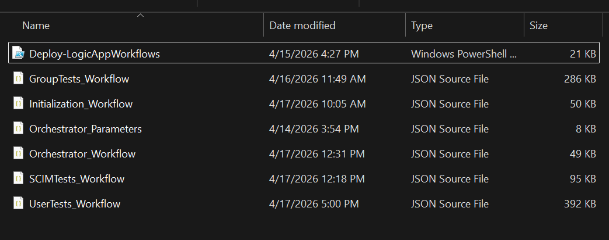

1. Open Azure CLI, Select all the files and upload all the files to Azure\.

1. Get the Subscription, ResourceGroup and LogicAppName from the Overview page\.

1. Run the following command 

\.\\Deploy\-LogicAppWorkflows\.ps1 \`

    \-SubscriptionId $subscriptionId \`

    \-ResourceGroup  $resourceGroupName \`

    \-LogicAppName   $LogicAppName

All the Workflows of the Logicapp are deployed as below\.

1. Next, we will enable system\-assigned managed identity for secure resource access\. Select __Settings > Identity__\.

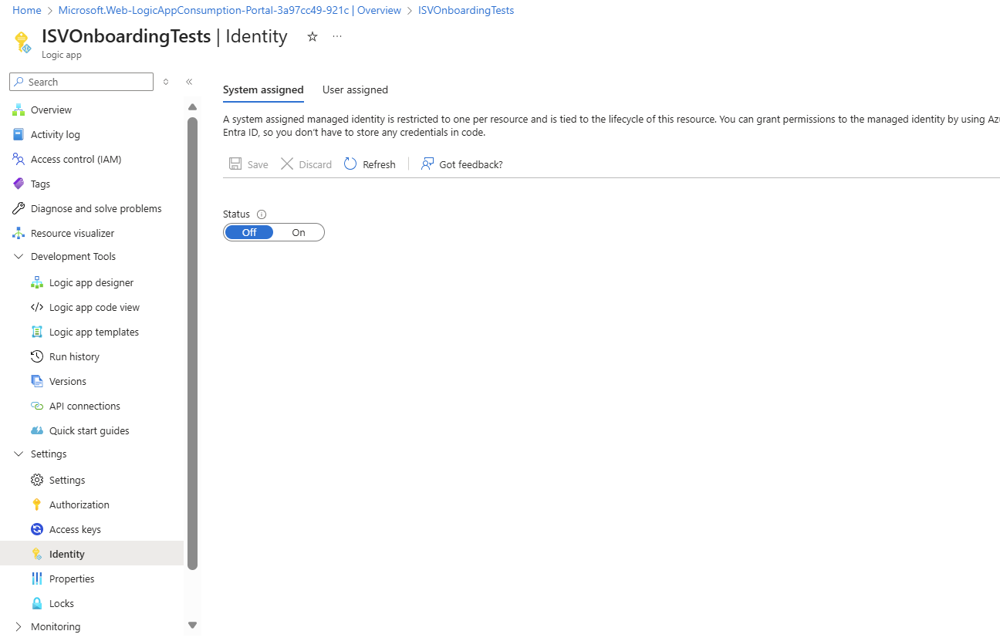

1. Set the __Status __in the __System assigned__ tab to __On__\. Select __Yes __in the confirmation dialog that pops up\.

1. Select __Save__\.

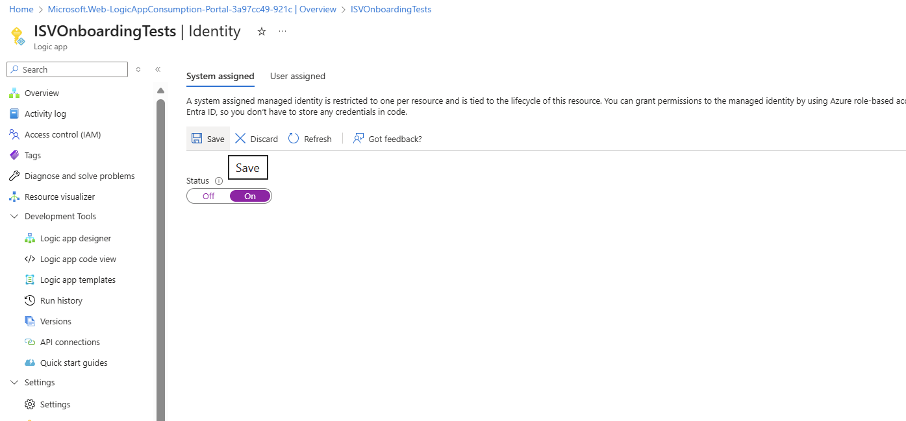

1. Take note of the object ID of the managed identity\. You will need this object ID for the script that you will run in a few steps\.

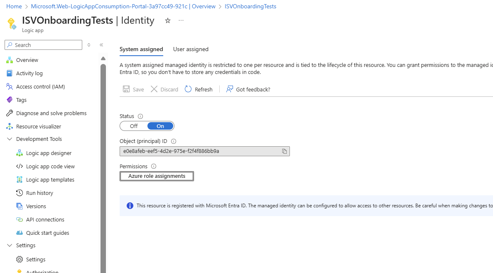

1. Now let’s work on granting the owner role to the Logic app\. Select __Azure role assignments__\.
2. In the __Azure role assignments__ page, click on __Add role assignment__ and select the __Owner__ role\.

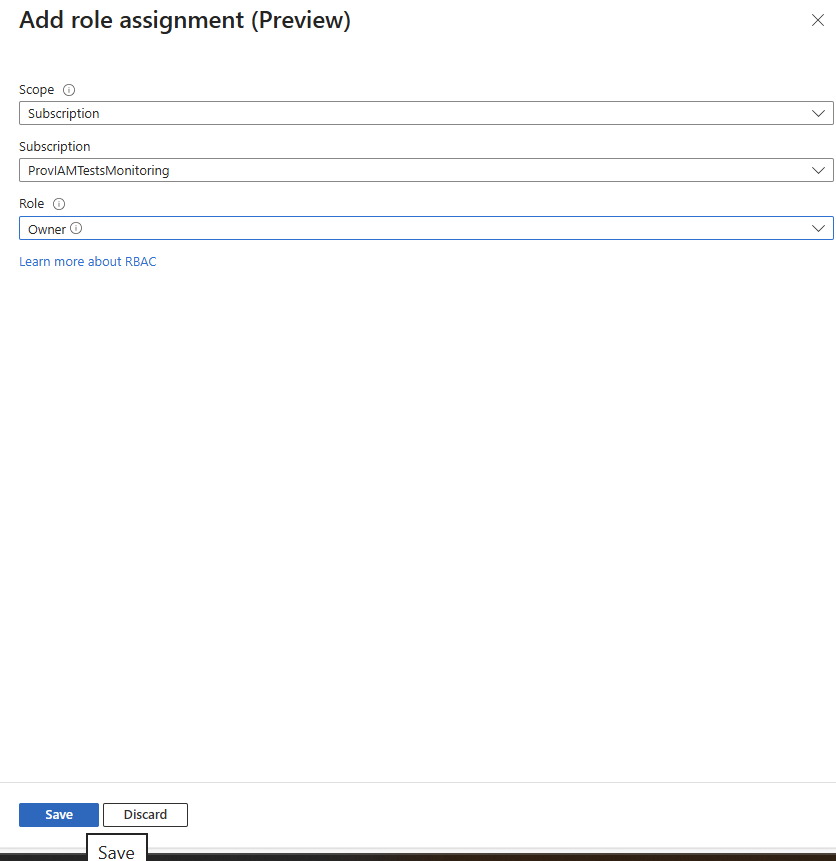

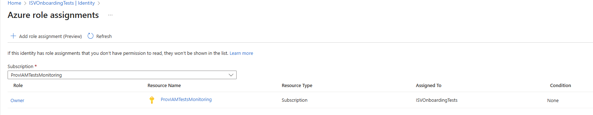

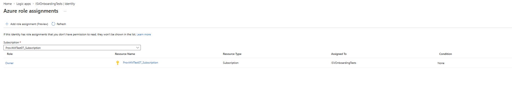

Once the owner role has been granted to the Logic app, you can now work on assigning the proper permissions to the Logic app so that it can invoke various Graph queries as part of the automated tests it will run \(the Logic app will create, update, and delete users and groups, query provisioning logs, etc\.\)\.

You may choose to use Azure CLI or PowerShell for the following steps\.

1. Go to the sample script provided in the [appendix](#_Script_for_assigning) of this document\. Copy the script for your records, and update the value of the __$miObjId__ field with the object ID of your Logic app’s managed identity\.

1. Run the script using the command\-line interface of your choice\. If using a UI like Azure Cloud Shell that provides you with an option to upload a file, you may opt to copy the script into a file, upload the file, then run the script\.

*How to upload and run a script using Azure Cloud Shell*

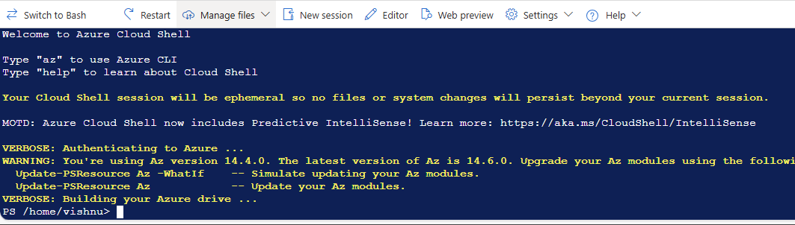

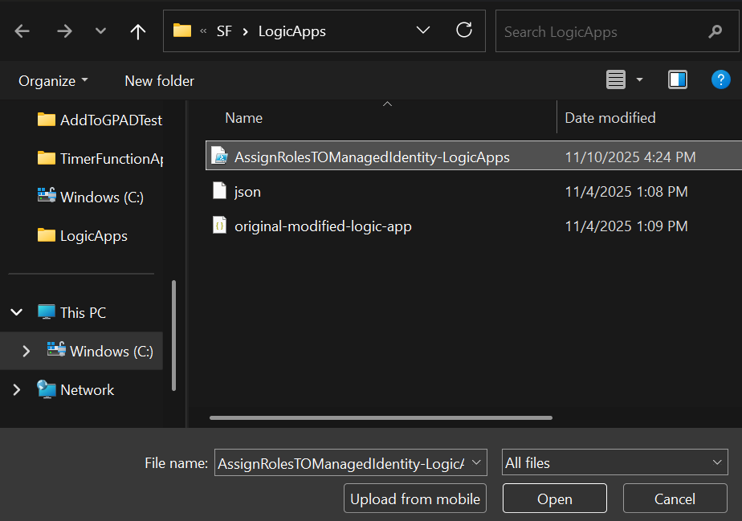 

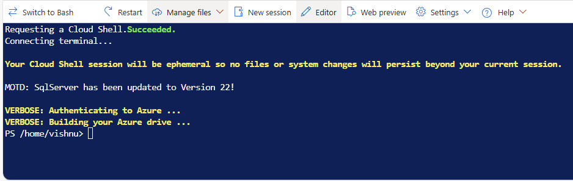 

Once the script successfully runs, you will have assigned all the necessary roles to the managed identity of your Logic app\.

### Logic App Explanation:

The Logic App is built on Azure Logic Apps Standard and is divided into separate sections\. It consists of 5 workflows that work together using a nested workflow architecture\. The Orchestrator workflow is the entry point, and it calls the other workflows as child workflows\. Initialization workflow initializes the required steps to run the tests in the Logic App\. 

The next section contains the tests\. Tests are bundled into user and group and scim workflows\. All the User Tests are in ‘UserTests\_workflow’ and Group tests in ‘GroupTests\_worklfow’ and SCIM tests in “SCIMTests\_workflow’\. Each test can be run individually or all together using the \`EnabledTests\` parameter\.

You can select each workflow and can view the tests it has in the Designer\.Each test can be further drilldown by selecting the down arrow and to get into details of stages and the actions\. Each stage and action can be drilled down till the inputs and outputs are displayed for each action\.

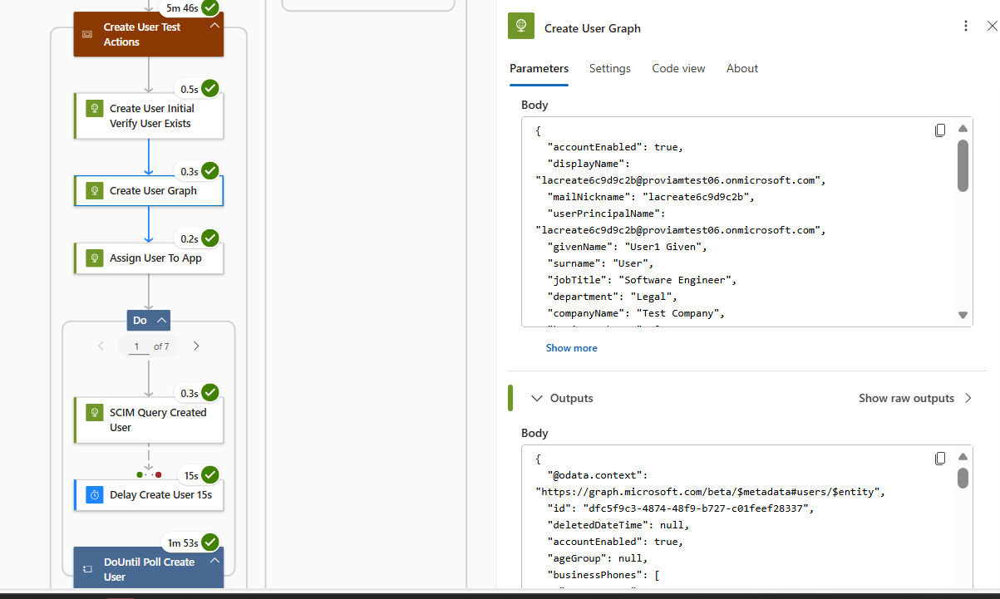

The last section in the Orchestartor\_workflow is for post run results evaluation\.

## Run: Steps to Run Logic app

Before we run your Logic app, let’s provide values for your Logic app’s required run parameters\. Save the Logic app after updating parameters before Run\. Open Orchestrator WorkFlow in Designer and Update the Parameters \.

### Providing Values To Parameters

1. The __servicePrincipalId__ is the __objectId__ of the non\-gallery SCIM app you created in the [previous section](#_Set_up_your)\.

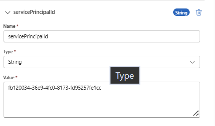

1. Enter your SCIM endpoint\.
	1. __Note__: don’t include feature flags like aadOptscim062020 in the scim endpoint here\. Even if you have to configure your non gallery app with feature flags\.

1. Enter your SCIM bearer token\.

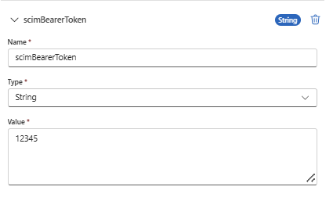

1. Under __testUserDomain__, enter a verified domain that belongs to your tenant\. This domain will be used to create test users in Entra ID and provision them to your SCIM endpoint as part of the automated tests that the Logic app template will run\. *Note: A Logic app template that successfully completes all tests will clean up any test users that were created during that run\. If the Logic app template does not complete a full, clean run, test users may not be cleaned up\. For example, stubs of the test user accounts will remain in your tenant if the Logic app template fails the Delete User tests or if you choose to interrupt the Logic app template before it has the chance to complete delete operations\.*

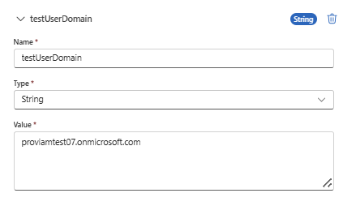

1.  Under defaultUserProperties give the different sets of user Properties values to test\. The Logic App takes one choose one set of the defaultUserProperties to create User and another set for updating User\. Selection is random based on no\. of sets\.

1. __EnabledTests__ can take one of the below values\. We support running all tests in parallel, running individual tests, or running tests related to only users or only groups\. __*Only one value should be provided\. *__

__“All” \-  __All tests will run

__“UserTests” \-__  All of the User Tests will run\. Groups and SCIM Tests are skipped\.

__“GroupTests” –__ All of the Group Tests will run\. User and SCIMTests are skipped\.

__“SCIMTests” –__ All of the SCIM tests will run\. User and Group test will be skipped

     "All",

                    "UserTests",

                    "GroupTests",

                    "Create\_User\_Test",

                    "Update\_User\_Test",

                    "Delete\_User\_Test",

                    "User\_Disable\_Test",

                    "User\_Update\_Manager\_Test",

                    "Create\_Group\_Test",

                    "Update\_Group\_Test",

                    "Delete\_Group\_Test",

                    "Group\_Update\_Add\_Member\_Test",

                    "Group\_Update\_Remove\_Member\_Test",

	     “Schema\_Discoverability\_Test”,

	     “SCIM\_Null\_Update\_Test”,

	     “Validate\_Credentials\_Test”

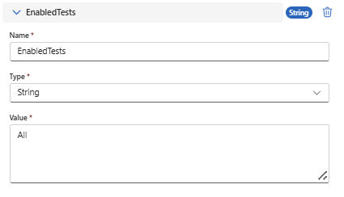

1. IsSoftDeleted can be ‘true’ or ‘false’\. Set to true only if soft deletion is supported and defined in your SCIM schema\. This property indicates that the user resource is marked for soft deletion—meaning it is flagged for removal but not permanently deleted\. “Disable\_User\_Test’ and “Delete\_User\_Test” are dependent on the correct value of this parameter\. If ‘IsSoftDeleted’ is false, then “Disable\_User\_Test” will be skipped\.

1. Update scimClientId with client id\.

1. Update client secret

1. Update ISV token endpoint

## Run the Logic App

1. You’re now ready to run the Logic app\! Navigate to __WorkFlows> __Select__ Orchestrtor\_workflow__, 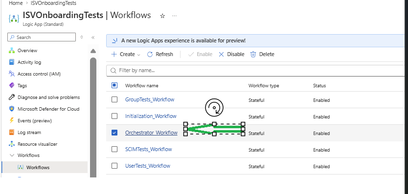
2. From the Orchestartor\_workflow’s designer, select “__Run__”

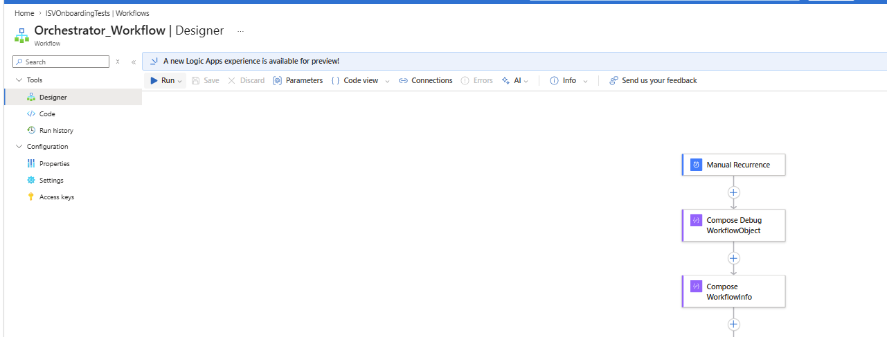

### Post\-Run: Verify the Runs and the next steps

## Verify the Runs

1. You can view logs of your runs in the __Runs history__ blade\. When clicking on an entry in __Runs history__, you check the final results of that entry, including the list of tests that were run, alongside status and any errors that may have come up\.

## Debugging

1. Debugging Logic App:

 Check the Final\_TestResults action of the Orchestrator\_workflow’s run to learn about the tests and their results\.

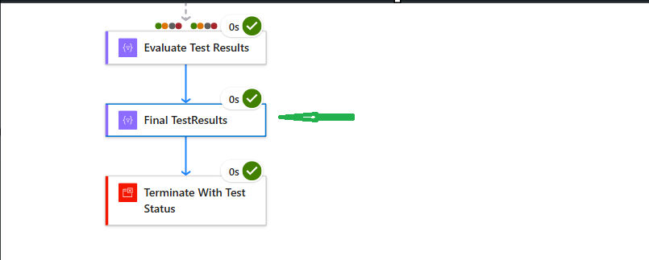

In Final\_TestResults \-> Select 'Show raw Outputs’\.

For each test, “testResult” shows the success / failure / skipped\. In case of failure the phase and action name for the failure is displayed\. Copy the action name\. “Ctrl \+ Click” on the runLink\. It opens the child workflows run\.  Search the action name and can debug and look furthermore for error details\. Tip section below shows how to debug further and search for specific actions\. Identify the failures from failed actions inputs/outputs give further details about why that call is failed\. Verify if the schema is valid and all the parameters are set according to the Schema\. Fix the parameters or schema and run the logic app again\.

“provisioningErrorDetails” gives the glimpse of Error information in case of failure\. 

*Tip: *More details about the run can be found by drilling down to the test definition and checking the input/output\. Here’s a sample of how the output may look like:

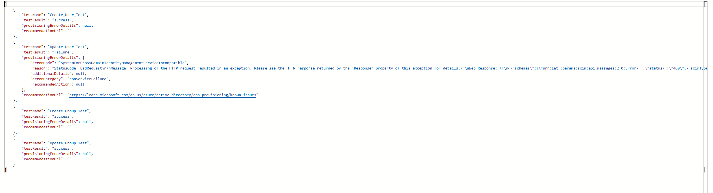

*Another tip: *Go to the run you want to debug further\. In the left you can query for a specific stage / action on the magnifying glass icon\. 

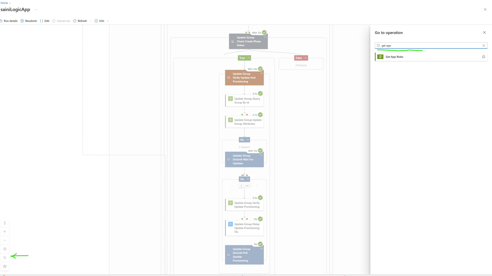

## Test Results

1. Once you see the tests have passed and you are ready to move to onboarding\. Provide the test results for us to validate and onboard\.

Run the Powershell validation script and provide us with the generated JSON file\.

__Prerequisites__

- __PowerShell Version 7\.0\+__: Install from [https://aka\.ms/powershell](vscode-file://vscode-app/c:/Users/v-mchittoory/AppData/Local/Programs/Microsoft%20VS%20Code/resources/app/out/vs/code/electron-browser/workbench/workbench.html) or PowerShell 5\.1 with \`\-SkipActionDetails\` flag
- __Azure Role__ \- Reader or Logic App Operator on the Logic App resource
- __Azure CLI__ \- Install from [https://aka\.ms/installazurecli](https://aka.ms/installazurecli)

__Note:__ The script uses Azure CLI internally to obtain access tokens for Azure Resource Management \(ARM\) API calls\.

__31\.1 Login to Azure__

Open PowerShell and run:

az login

\# Set the subscription you want to use

az account set \-\-subscription "YOUR\_SUBSCRIPTION\_ID"

__31\.2 Run the Validation Script__

Download the Validation script provided in the appendix\.

Navigate to the script directory and run:

\.\\ValidateLogicAppRun\-Standard\.ps1 \`

    \-SubscriptionId "YOUR\_SUBSCRIPTION\_ID" \`

    \-ResourceGroup "YOUR\_RESOURCE\_GROUP" \`

    \-LogicAppName "YOUR\_LOGIC\_APP\_NAME" \`

    \-RunId "YOUR\_RUN\_ID"

__Where to find these values:__

- Subscription ID: Azure Portal → Subscriptions → Your Subscription → Copy the ID
- Resource Group / Logic App Name: Azure Portal → Your Logic App → Overview
- Run ID: Azure Portal → Your Logic App → Run History → Copy the Run ID

__Optional Parameters:__

\-SkipActionDetails: Skip fetching action inputs/outputs \(faster execution, works with PowerShell 5\.1\)

__Note:__ If copy\-pasting the command, verify that hyphens \(\-\) before parameters are correct, as some applications replace them with different dash characters\.

__Example__

\.\\ValidateLogicAppRun\-Standard\.ps1 \`

    \-SubscriptionId "12345678\-1234\-1234\-1234\-123456789012" \`

    \-ResourceGroup "rg\-provisioning\-prod" \`

    \-LogicAppName "la\-scim\-validator" \`

    \-RunId "08584361051946613703020273411CU28"	

__31\.3 Submit Results__

Send us the generated JSON file:__ __validation\-result\-\{RunId\}\.json

The script displays __VALIDATION PASSED__ \(green\) or __VALIDATION FAILED __\(red\) in the console upon completion\.

__What Gets Validated__

- Run completed successfully
- No failed actions
- All required provisioning stages executed \(dynamically extracted from template\)
- All template actions executed \(no modifications\)

__Troubleshooting the Validation Script__

Issue

Solution

"Authentication failed"

Run az login and sign in again

"Cannot access Logic App"

Verify subscription ID, resource group, and Logic App name\.

Check you have proper Azure permissions\.

"No subscriptions found"

Wait 5\-10 minutes after role assignment, then run az account clear and az login

Script execution policy error

Run: Set\-ExecutionPolicy RemoteSigned \-Scope CurrentUser

"This script requires PowerShell 7\.0 or later for parallel processing\."

Install PowerShell 7\+ or run with \-SkipActionDetails flag

__Understanding Results__

- __VALIDATION PASSED__ \- Run succeeded with valid template
- __VALIDATION FAILED__ \- Check the JSON report for:
- __validationErrors__ \- High\-level issues
- __failedActions__ \- Specific errors with details
- __templateValidation\.requiredStages__ \- Stage execution status
- __actionComparison__ \- Missing or modified actions detected

When we release the full self\-service onboarding experience for provisioning integrations, you will provide us with a __Run ID__ associated with a successful run of your Logic app \(alongside details such as the subscription and resource group that your Logic app is associated with\)\. Run IDs will be valid for a finite number of days, during which we will review your submission and work on deploying your provisioning integration to the Microsoft Entra app gallery\. You will be given access to this experience when it releases to Private Preview in CY2026\.

## Next Steps after successful run

Provide us the following information\.

- 
	1. Generated Logic App test results as described in [Test Results](#_Test_Results) section\.
	2. \[Required only if your run was done on Logic app template published before 02/09\] Export Pruned Schema as mentioned in Logic App setup instructions or as mentioned in [Export Application Provisioning configuration and roll back to a known good state for disaster recovery in Microsoft Entra ID \- Microsoft Entra ID | Microsoft Learn](https://learn.microsoft.com/en-us/entra/identity/app-provisioning/export-import-provisioning-configuration#export-your-provisioning-configuration)
	3. Since this is a pilot, we would like to run the tests ourselves as a sanity check\. This step will not be required once we build an end\-to\-end experience\. For this, we will need the SCIM endpoint and a long\-lived bearer token\. Please also let us know if there are any constraints \(for example, a required domain for the userPrincipalName\)

# Understanding the Test Results

The Logic App runs 13 tests: 5 User tests, 5 Group tests, and 3 SCIM compliance tests\. This section explains how to find and read the results\.

### Where to Find the Results

__If using the agent \(Method A\):__ The agent fetches and displays the results automatically\. No portal navigation needed\.

__If using manual setup \(Method B\):__ 1\. In the Azure portal, go to your Logic App → __Workflows__ → __Orchestrator\_Workflow__ 2\. Click __Run history__ and select your run 3\. Find the action called __Final\_TestResults__ \(near the bottom of the workflow\) 4\. Click on it → select __Show raw outputs__ 5\. The JSON output contains all test results

### The Results JSON Structure

Each test result in the Final\_TestResults output looks like this:

\{  
  "testName": "Create\_User\_Test",  
  "testResult": "success",  
  "provisioningErrorDetails": "",  
  "recommendationUrl": "",  
  "runLink": "https://portal\.azure\.com/\#view/\.\.\.",  
  "message": "Click the runLink and search for the action Compose\_Final\_Results for more info\."  
\}

Here’s what each field means:

Field

What It Tells You

__testName__

The name of the test \(e\.g\., Create\_User\_Test, Update\_Group\_Test\)

__testResult__

"success" if the test passed\. If the test failed, this contains the failure description including the phase and action name that failed \(e\.g\., "FAILED \- \[Delete Phase\] Failed Action: Delete\_Step5\_Delete\_Group\_By\_Id"\)

__provisioningErrorDetails__

Empty if the test passed\. On failure, contains the HTTP status code, error body, and error message from the Graph API or SCIM endpoint call that failed\. __This is the most important field for debugging\.__

__recommendationUrl__

A link to Microsoft documentation that may help resolve the issue

__runLink__

A direct link to the child workflow run in the Azure portal\. Click this to drill into the workflow designer and inspect individual action inputs/outputs\.

__message__

Instructions on how to find more details in the workflow run

### Possible Test Result Values

Result

Meaning

Action Required?

"success"

Test passed — your SCIM endpoint handled the operation correctly

✅ None

"FAILED \- \[Phase\] Failed Action: <action\_name>"

Test failed at a specific action\. The phase \(e\.g\., Create Phase, Update Phase, Delete Phase\) and action name tell you exactly where it broke\.

❌ Yes — see Debugging below

"skipped"

Test was skipped because a prerequisite was not met \(e\.g\., Disable\_User\_Test skipped when IsSoftDeleted is false, or group tests skipped when groups are not supported\)

✅ None \(if intentional\)

"Token acquisition failed"

Only for Validate\_Credentials\_Test — the OAuth token request failed\. Expected when using a static bearer token\.

✅ None \(if using static token\)

"The SCIM schema does not support all attributes\.\.\."

Schema\_Discoverability\_Test found that your SCIM schema doesn’t advertise all the attributes in the provisioning mappings\. The details show how many are supported vs mapped\.

⚠️ Prune your attribute mappings to match

### Sample Results — All Tests Passed

\{  
  "testResults": \[  
    \{ "testName": "Create\_User\_Test", "testResult": "success" \},  
    \{ "testName": "Update\_User\_Test", "testResult": "success" \},  
    \{ "testName": "Disable\_User\_Test", "testResult": "success" \},  
    \{ "testName": "Delete\_User\_Test", "testResult": "success" \},  
    \{ "testName": "User\_Update\_Manager\_Test", "testResult": "success" \},  
    \{ "testName": "Create\_Group\_Test", "testResult": "success" \},  
    \{ "testName": "Update\_Group\_Test", "testResult": "success" \},  
    \{ "testName": "Delete\_Group\_Test", "testResult": "success" \},  
    \{ "testName": "Group\_Update\_Add\_Member\_Test", "testResult": "success" \},  
    \{ "testName": "Group\_Update\_Remove\_Member\_Test", "testResult": "success" \},  
    \{ "testName": "Schema\_Discoverability\_Test", "testResult": "success" \},  
    \{ "testName": "SCIM\_Null\_Update\_Test", "testResult": "success" \},  
    \{ "testName": "Validate\_Credentials\_Test", "testResult": "Token acquisition failed" \}  
  \],  
  "overallResult": "Failed"  
\}

__Note:__ Even with 12/13 tests passing, the overallResult shows "Failed" because Validate\_Credentials\_Test did not pass\. This is expected when using a static bearer token — it does not block onboarding\.

### Sample Results — With a Failure

\{  
  "testName": "Delete\_Group\_Test",  
  "testResult": "FAILED \- \[Delete Phase\] Failed Action: Delete\_Step5\_Delete\_Group\_By\_Id",  
  "provisioningErrorDetails": \{  
    "provisioningLogs": \{  
      "statusCode": 403,  
      "body": \{  
        "error": \{  
          "code": "Authorization\_RequestDenied",  
          "message": "Insufficient privileges to complete the operation\."  
        \}  
      \}  
    \}  
  \}  
\}

__How to read this failure:__ \- __testResult__ tells you it failed during the __Delete Phase__ at the action __Delete\_Step5\_Delete\_Group\_By\_Id__ \- __provisioningErrorDetails__ shows the actual HTTP error: __403__ with __Authorization\_RequestDenied__ — the Logic App’s managed identity doesn’t have sufficient permissions \- __Fix:__ Assign the missing Graph API permission to the managed identity and re\-run

### How to Debug a Failed Test

1. __Read provisioningErrorDetails__ in the results JSON — this usually tells you the root cause \(HTTP status code \+ error message\)
2. __Click the runLink__ — this opens the child workflow run in the Azure portal
3. __Search for the failed action name__ \(from testResult\) in the workflow designer
4. __Click the failed action__ → check __Inputs__ \(what was sent\) and __Outputs__ \(what came back\)
5. The HTTP response body in the outputs contains the exact error from the Graph API or your SCIM endpoint

__If using the agent \(Method A\):__ The agent does steps 1–5 automatically and tells you the root cause and fix\.

### What “Passing” Means for Onboarding

To proceed with gallery onboarding, __all applicable tests must pass__\. The following are acceptable exceptions: \- Validate\_Credentials\_Test failing when using a static bearer token \(OAuth will be required for production\) \- Schema\_Discoverability\_Test showing a mismatch — prune the attribute mappings in the Entra portal to match your SCIM schema \- Group tests being skipped if your application does not support group provisioning

## Automatic Failure Diagnosis

If tests fail, the agent automatically:

1. Fetches the Final\_TestResults from the Orchestrator workflow
2. Drills into child workflow actions to find the actual HTTP error
3. Matches against known issue patterns
4. For auto\-fixable issues \(e\.g\., missing permissions, schema validation errors, feature flags in endpoint\), applies the fix and re\-runs automatically
5. For ISV\-side issues \(e\.g\., SCIM filter not supported, 404 on empty queries\), explains exactly what to fix

### Common Auto\-Fixed Issues

Issue

What the Agent Does

aadOptscim062020 feature flag in endpoint

Removes the flag from parameters, re\-runs

Missing Graph API permission

Assigns the missing permission, waits for propagation, re\-runs

Schema validation error \(canonical values\)

Extracts allowed values, updates user profiles, re\-runs

Missing fields in defaultUserProperties

Adds the missing property to all user profiles, re\-runs

### Issues Requiring Your Action

Issue

What You Need to Do

Bearer token expired

Provide a new long\-lived token

SCIM filter not supported

Implement filter support on matching properties

404 on empty filter queries

Return 200 \+ empty results \(mandatory\)

Group PATCH not supported

Implement multi\-member PATCH on /Groups

Rate limiting \(429\)

Support ≥25 req/s

# Frequently Asked Questions: 

Note: Below are some of the known issues and most probable explanations\. Each issue could be caused by many other reasons too\.

1. __Why do errors occur when the aadOptscim062020 feature flag is used with a Logic App SCIM endpoint?__

__Explanation  
__The aadOptscim062020 feature flag is supported only for Microsoft Entra ID provisioning scenarios\. This flag is not required in logic app configuration\. When it is configured on a Logic App SCIM endpoint, SCIM GET requests may fail with Bad Request errors\.

__Resolution  
__Remove the aadOptscim062020 flag from the Logic App SCIM endpoint configuration\.  
Configure this flag only while setting up connection in non gallery app by going to:

Microsoft Entra ID → Enterprise Application → Provisioning → Tenant URL

1. __Why do Logic App test runs fail intermittently due to authentication issues?__

__Explanation  
__Logic App test runs can exceed the lifetime of short\-lived access tokens\. When a token expires during execution, authentication failures may occur\.

__Resolution  
__Use long\-lived access tokens when running Logic App tests\.

1. __Why does the Get\_Templates action return an Unauthorized error?__

__Explanation  
__The Logic App’s Managed Identity does not have sufficient permissions to access the required template resources\.

__Resolution  
__Assign the appropriate roles to the Managed Identity and allow time for permission changes to take effect\.  
If the issue continues, recreate the Logic App and reconfigure the Managed Identity and permissions\.

1. __ Why do SCIM requests with attribute\-based filters fail?__

__Explanation  
__Microsoft Entra ID can issue SCIM GET requests with filters on __any attribute configured as a matching property__\. When such a request is sent, the target SCIM endpoint is expected to support filtering on that matching property\.

If the SCIM server does not support filtering on one or more matching properties configured in Entra ID, the filtered request may fail and appear as an error in provisioning logs\.

__Resolution  
__Ensure that the SCIM endpoint supports filtered GET requests for __all attributes configured as matching properties__ in:

Enterprise Application → Provisioning → Attribute Mappings

__Examples__

- __Email as a matching property__  
If emails\[type eq "work"\]\.value is configured as a matching property, the SCIM endpoint must support filtering on this attribute\. The following example API call __must be supported__:

GET /scim/v2/Users?filter=emails\[type eq "work"\]\.value eq "user@contoso\.com"

1. __Why do Logic App tests fail with a SCIM 409 Conflict error?__

__Possible Explanation  
__In some scenarios, the SCIM service may not respond as expected to update requests, which can result in retry attempts and a 409 Conflict error\.

__Resolution  
__Re\-run the test to confirm whether the issue is transient\.  
If the issue occurs consistently, verify that the SCIM service responds correctly to update requests and does not introduce response delays\.

1. __Why does a Logic App SCIM GET API call fail when querying a nonexistent user?__

__Explanation__  
The SCIM specification allows a server to return a 404 Not Found response when a queried user does not exist\. Although this behavior is SCIM compliant, it is not supported by this system\.

This system requires SCIM servers to return a __successful response \(200 OK\) with zero results__ for filter\-based queries that do not match any users\. If a SCIM server returns a 404 Not Found response for a nonexistent user, the Logic App SCIM GET call fails due to incompatibility with the expected response behavior\.

__Resolution__  
As part of onboarding, ensure that the SCIM endpoint is configured to return a __200 OK response with zero results__ \(for example, totalResults: 0 and an empty Resources array\) when a queried user does not exist\.

This behavior is a __mandatory onboarding requirement__ and is validated during the onboarding checklist process\.

# Provide feedback

Once you get a chance to test the pilot, please fill out the following feedback form: [Feedback Form for Self\-Service Validation of Provisioning Integrations \(Pilot\) – Fill out form](https://forms.microsoft.com/Pages/ResponsePage.aspx?id=v4j5cvGGr0GRqy180BHbR1xPIYfdXw5FhHBIH8BxY9ZUNTJTRkc0SDUxOTdHSFk5UEZQVkVZRjhTMy4u)

In the form, you may specify whether you are interested in participating in a follow\-up feedback session with the Entra App Provisioning feature team\. In this feedback session, we would ask you more questions about your experience\.

We’re excited to hear more from you\! Thank you for participating in our pilot—your insights help us make Microsoft Entra ID better\.

# Appendix

## Script for assigning permissions to your Logic app

[SCIMReferenceCode/Microsoft\.SCIM\.LogicAppValidationTemplate/AssignRolesTOManagedIdentity\-LogicApps 1\.ps1 at master · AzureAD/SCIMReferenceCode · GitHub](https://github.com/AzureAD/SCIMReferenceCode/blob/master/Microsoft.SCIM.LogicAppValidationTemplate/AssignRolesTOManagedIdentity-LogicApps%201.ps1)

## Script for Logic App Validation

[SCIMReferenceCode/Microsoft\.SCIM\.LogicAppValidationTemplate/StandardLogicApp/ValidateLogicAppRun\-Standard\.ps1 at master · AzureAD/SCIMReferenceCode · GitHub](https://github.com/AzureAD/SCIMReferenceCode/blob/master/Microsoft.SCIM.LogicAppValidationTemplate/StandardLogicApp/ValidateLogicAppRun-Standard.ps1)

## Script for Workflow Deployment

[SCIMReferenceCode/Microsoft\.SCIM\.LogicAppValidationTemplate/StandardLogicApp/Deploy\-LogicAppWorkflows\.ps1 at master · AzureAD/SCIMReferenceCode · GitHub](https://github.com/AzureAD/SCIMReferenceCode/blob/master/Microsoft.SCIM.LogicAppValidationTemplate/StandardLogicApp/Deploy-LogicAppWorkflows.ps1)

