# Overview

Welcome to the pilot for **self-service validation of your provisioning
integration with Azure Logic apps**!

The Entra App Provisioning and Single Sign-On teams are currently
working on building a revamped onboarding experience where ISVs can
self-service onboard their provisioning or SSO integrations to the
Microsoft Entra app gallery. This will enable you to bring your
application into the Microsoft ecosystem faster and more efficiently
than ever before.

The self-service onboarding experience will consist of multiple
components:

1.  A process to self-service validate that your provisioning
    integration is ready to onboard to the Microsoft Entra app gallery
    via a provided Azure Logic app template

2.  A process to self-service validate that your SSO integration is
    ready to onboard to the Microsoft Entra app gallery via a browser
    extension

3.  An intake form in the Entra portal where you can submit a publishing
    request for your SSO and/or provisioning application

This document walks you through **\#1**, the process of self-service
validating that your provisioning integration is ready to onboard to the
Microsoft Entra app gallery. We are seeking your feedback on the
validation experience, including what you enjoy and what we can improve.

## Disclaimer

This feature is currently in PREVIEW. This information relates to a
pre-release product that may be substantially modified before it's
released. Microsoft makes no warranties, expressed or implied, with
respect to the information provided here.

## Support for preview

Microsoft Premier support will not provide support during the pilot. If
you have questions or feedback to provide, you may reach out to the
feature team managing this pilot at <aaduserprovisioning@microsoft.com>.

# Onboarding requirements

*<u>Technical requirements</u>*

For your application to be eligible to onboard to the Microsoft Entra
app gallery, your provisioning integration must meet the following
requirements:

- Support a SCIM 2.0 user or group endpoint (only one is required, but
  supporting both a user and group endpoint is recommended)

- Support the OAuth 2.0 Client Credentials grant as your primary
  authentication method

  - Note: Client Credentials is not required to participate in this
    pilot (i.e. you need to use ***long lived* bearer token** to test
    the Logic app). However, Client Credentials will be required to
    onboard to the Microsoft Entra app gallery

  - Currently, Client Credentials is the only authentication method we
    support for requests to onboard new provisioning integrations to the
    Microsoft Entra app gallery

  - Requirements for Client Credentials: An admin portal where a
    customer can generate a client ID and secret

  - Best practices: Support the ability to rotate secrets and delete old
    secrets

- Support updating multiple group memberships with a single PATCH
  request

- Support at least 25 requests per second per tenant to ensure that
  users and groups can be provisioned and deprovisioned without delay

- On querying for a nonexistent user with filter query, your server
  should respond with success and empty results. (on contrast with bad
  request as we see in some SCIM implementation)

- Your SCIM endpoint does not require features that Microsoft does not
  support today. Examples of features that the non-gallery SCIM app does
  not currently support:

  - Verbose PATCH calls

  - Support for batching calls (i.e. including multiple add operations
    in the same PATCH call)

  - Rate limiting

*<u>Validation requirements</u>*

This document provides you with instructions on how to self-service
validate your application, so that it is ready to onboard to the
Microsoft Entra app gallery. Once you complete the instructions in this
document, you will have completed the following pre-requisites:

- You should have set up a non-gallery SCIM app with a successful sync.
  This step requires:

  - A SCIM endpoint. If you need guidance on how to develop a SCIM
    endpoint, you can refer to our public documentation:
    <https://learn.microsoft.com/entra/identity/app-provisioning/use-scim-to-provision-users-and-groups>

  - An Entra ID tenant. If you don’t already have one, you can follow
    the instructions here to create one:
    <https://learn.microsoft.com/entra/identity-platform/quickstart-create-new-tenant>

  - You must have at least an **Application Administrator** role in the
    Entra ID tenant.

  - If your app will support only group provisioning, an [Entra ID
    Premium P1
    license](https://learn.microsoft.com/entra/fundamentals/licensing)
    is required for group-only provisioning to function (a P1 license is
    not required if “Provision all” is selected). A trial license will
    work. *Note: If you have an [M365 E3 or E5
    license](https://www.microsoft.com/microsoft-365/enterprise/microsoft-365-plans-and-pricing),
    Entra Premium is included as part of those license packages.*

- You should complete a successful run of our Logic app validation
  template, with no errors returned. This step requires:

  - In the same tenant where your non-gallery SCIM app is hosted, an
    Azure subscription for Logic app testing. The Logic app template
    functions on a [standard
    model](https://learn.microsoft.com/azure/logic-apps/single-tenant-overview-compare),
    meaning that you will likely incur a small monetary cost as a result
    of running the Logic app. This cost is expected to be small (less
    than 10 USD per month on an [Azure pay-as-you-go
    subscription](https://azure.microsoft.com/pricing/purchase-options/azure-account/search?icid=hybrid-cloud&ef_id=_k_CjwKCAiA8vXIBhAtEiwAf3B-gwGo45BSp9MkHu1_SsZHPGytGsYgUoGgKhwiVKvh4pCybuz62bqCnhoCYlgQAvD_BwE_k_&OCID=AIDcmm5edswduu_SEM__k_CjwKCAiA8vXIBhAtEiwAf3B-gwGo45BSp9MkHu1_SsZHPGytGsYgUoGgKhwiVKvh4pCybuz62bqCnhoCYlgQAvD_BwE_k_&gad_source=1&gad_campaignid=21496728177&gbraid=0AAAAADcJh_siQ5FaD4VnPUpZunMKSJ2sy&gclid=CjwKCAiA8vXIBhAtEiwAf3B-gwGo45BSp9MkHu1_SsZHPGytGsYgUoGgKhwiVKvh4pCybuz62bqCnhoCYlgQAvD_BwE)).

  - You must have permissions to create a Logic app under the
    appropriate subscription and resource group. This will require at
    least a [Logic app
    contributor](https://learn.microsoft.com/azure/logic-apps/logic-apps-securing-a-logic-app?tabs=azure-portal)
    role, but more permissions may be required depending on whether you
    also need to create a subscription and resource group.

  - If the Get API call do not have any results, the SCIM server should
    return 0 results but not a Bad Request.

*<u>Publishing requirements</u>*

While not required to participate in this pilot, the following is
required to complete the self-service publishing experience once it
becomes available for Private Preview in CY2026:

- Your tenant must be registered as a partner in Microsoft Partner
  Center and enrolled in the Microsoft AI Cloud Partner program.

- You must have documentation for your SCIM endpoint ready to publish.
  Once Private Preview starts, a documentation template will be
  available for you to use.

  - End customers should be able to access documentation about your SCIM
    endpoint on both your website and the Microsoft Learn website.

- Please provide us with engineering and support contacts for us to
  refer end customers to once your application is published to the
  Microsoft Entra app gallery.

# Two Ways to Validate Your Integration

You can validate your SCIM provisioning integration using either of two
methods:

|  | **Method A: AI Agent (Automated)** | **Method B: Manual Setup** |
|----|----|----|
| **What** | Use the `scim-onboarding.agent.md` file with an AI tool — the agent automates the entire process conversationally | Follow step-by-step instructions in this document to manually create resources, deploy the Logic App, configure parameters, and run tests |
| **Time** | 30–60 minutes (guided, mostly automated) | 1–3 hours (manual steps) |
| **Skills needed** | Basic familiarity with an AI chat tool | Azure Portal, Entra Portal, PowerShell/CLI |
| **Best for** | Faster setup, automated debugging and re-runs | Full control over every step |

**Both methods produce the same result:** a validated Logic App run that
you can submit to Microsoft.

Choose your preferred method: - **Method A** — Continue reading the
sections below for manual step-by-step instructions - **Method B** —
Jump to the section **“Alternative: Automated Setup Using the SCIM
Onboarding Agent”** later in this document

------------------------------------------------------------------------

# Method A: Agent-Automated Setup

The **SCIM Onboarding Agent** is an AI-powered agent that automates the
entire validation workflow. Instead of following 28 manual steps, you
have a conversation with the agent — it creates all Azure and Entra
resources, deploys the Logic App, runs tests, diagnoses failures, and
generates submission artifacts.

## What the Agent Does

The agent handles the entire validation process through a simple
conversation. Here’s what happens at a high level:

1.  **Asks you a few questions** — Your SCIM endpoint URL, bearer token,
    and authentication method, confirming Schema, Input parameters
    required for testing.
2.  **Sets up everything automatically** — Creates the Entra app, Azure
    resources, Logic App, assigning permissions — all the manual portal
    steps
3.  **Runs the tests** — Triggers all validation tests and monitors
    progress
4.  **Fixes problems** — If tests fail due to known issues, the agent
    fixes them and re-runs automatically, or provide recommendations for
    fixes in scim server
5.  **Gives you results** — Shows which tests passed/failed and
    generates the validation results that need to be submitted to
    Microsoft

You don’t need to navigate any portal or run any script — just answer
the agent’s questions and approve the commands it runs.

## Prerequisites

Before using the agent, ensure you have:

6.  **Azure CLI** installed and logged in — [Install Azure
    CLI](https://aka.ms/installazurecli)

- az login

7.  **Application Administrator** role in your Entra ID tenant

8.  **Azure subscription** with Logic App Contributor permissions

9.  Your **SCIM endpoint URL** (e.g., `https://scim.example.com/v2`)

10. A **long-lived bearer token** for your SCIM endpoint

11. The `scim-onboarding.agent.md` file (provided with this package)

## Setup Instructions

### Option A: Using Cline (VS Code Extension)

#### Setting Up Your AI Agent

#### The SCIM onboarding agent is a single instructions file that any AI coding agent can execute. You bring your own agent host and model — we provide the agent.

#### **Step 1:** Choose an AI agent host

#### Use any AI coding agent you already have, such as VS Code with GitHub Copilot, Cursor, Windsurf, Cline, Claude Code, or similar.

#### **Step 2:** Choose an AI model

#### The agent performs multi-step reasoning — collecting inputs, creating Azure resources, running tests, and debugging failures across Logic App workflows. Use a capable model:

|           |                           |
|-----------|---------------------------|
| Provider  | Minimum recommended model |
| Anthropic | Claude Opus 4 or later    |
| OpenAI    | GPT-4.1 or later          |
| Google    | Gemini 2.5 Pro or later   |

#### Smaller or older models may skip required inputs, fail to drill into errors, or retry failures without diagnosing the root cause.

#### **Step 3: \[Note:** these are just recommendation, at the agent is just a prompt file, feel free to load it anyway you can.\] 

#### Load the agent 

####  1. Create a project folder (e.g., C:\scim-validation)

####  2. Inside that folder, create the subfolder .github\agents\\

####  3. Place scim-onboarding.agent.md inside .github\agents\\

#### Your folder should look like:

####  C:\scim-validation\\

####  └── .github\\

####  └── agents\\

####  └── scim-onboarding.agent.md

####  1. Open this folder in your agent host:

####  - VS Code with GitHub Copilot — open the folder in VS Code. Copilot auto-discovers agents from .github/agents/. Invoke with @scim-onboarding in Copilot Chat.

####  - Cline / Cursor / Windsurf — open the folder, then load scim-onboarding.agent.md as a system prompt or custom instructions file.

####  - Claude Code — open the folder, then reference as context: @scim-onboarding.agent.md

####  - Other hosts — copy the file contents into your agent's system prompt or instructions field.

#### **Step 4:** Start

#### Send this message to the agent:

####  Validate my SCIM integration for Entra app gallery onboarding

#### The agent will ask for your SCIM endpoint, bearer token, OAuth credentials (if applicable), and guide you through the entire validation workflow.

When the agent requests to run commands, review and approve them

#### Step 5: Interact with the Agent

The agent will guide you through the process conversationally. Here’s
what to expect:

    Agent: What is your SCIM endpoint URL?
    You:   https://api.myapp.com/scim/v2

    Agent: What is your bearer token?
    You:   eyJhbGciOiJSUzI1NiIs...

    Agent: Does your SCIM endpoint use OAuth client credentials or a static bearer token?
    You:   Static bearer token

    Agent: ✅ Azure CLI — Logged in as admin@contoso.onmicrosoft.com
           ✅ SCIM endpoint — HTTP 200
           ✅ /Users — Supported
           ✅ /Groups — Supported
           
           I'll now create the Azure resources and deploy the Logic App...

    [Agent automatically creates everything and runs tests]

    Agent: ✅ VALIDATION RESULTS
           Create_User_Test: SUCCESS
           Update_User_Test: SUCCESS
           ...

### Option B: Using GitHub Copilot Chat (VS Code)

If you have **GitHub Copilot** with agent mode enabled:

#### Step 1: Set Up

1.  Ensure GitHub Copilot and Copilot Chat are installed in VS Code
2.  Place the `scim-onboarding.agent.md` file in your project folder
3.  Open the folder in VS Code

#### Step 2: Run

4.  Open **Copilot Chat** (Ctrl+Shift+I or click the Copilot icon)
5.  Switch to **Agent mode** (click the mode selector at the top of the
    chat panel)
6.  Reference the agent file and start:

<!-- -->

    @workspace Use the instructions in scim-onboarding.agent.md to validate my SCIM provisioning integration. Start the full validation workflow.

4.  Follow the prompts and approve command executions as requested

### Option C: Using Any AI Agent That Supports Tool Use

The `scim-onboarding.agent.md` file is a standard agent instruction
file. It can be used with any AI agent platform that supports: -
Reading/writing files - Executing CLI commands - Conversational
interaction

Simply provide the agent file as system instructions and ensure the
agent has access to a terminal with Azure CLI installed and
authenticated.

## Questions the Agent Will Ask You

The agent will ask you these questions one at a time during the
conversation. Have the answers ready before you start.

### Question 1: SCIM Endpoint URL

> “What is your SCIM endpoint URL?”

Provide the base URL of your SCIM 2.0 endpoint. This is the URL that
Microsoft Entra ID will send provisioning requests to.

**Example:** `https://api.myapp.com/scim/v2`

**Important:** Do NOT include the `?aadOptscim062020` feature flag in
this URL. If your endpoint requires this flag, it should only be
configured in the Entra portal’s Tenant URL field, not here.

### Question 2: Bearer Token

> “What is your bearer token for the SCIM endpoint?”

Provide a long-lived bearer token that the Logic App will use to
authenticate against your SCIM endpoint.

**Important:** The token must remain valid for at least 2 hours (the
test run can take 60–90 minutes). If your token is a short-lived JWT,
the tests will fail partway through. Use a token that lasts at least 24
hours.

### Question 3: Authentication Method

> “Does your SCIM endpoint use OAuth client credentials or a static
> bearer token?”

- **Static bearer token** — Most common for pilot testing. The agent
  will note that `Validate_Credentials_Test` will be skipped (this is
  expected).
- **OAuth client credentials** — If you choose this, the agent will ask
  4 follow-up questions:
  - **Client ID** — Your OAuth application’s client ID
  - **Client Secret** — Your OAuth application’s client secret
  - **Token Endpoint URL** — e.g., `https://auth.myapp.com/oauth/token`
  - **OAuth Scope** — The scope required for SCIM access (leave empty if
    not applicable)

### Question 4: Azure Subscription Selection

> “Which Azure subscription would you like to use?”

The agent will list your available Azure subscriptions. Pick the one
where the Logic App resources will be created. If you only have one
subscription, the agent selects it automatically.

### Question 5: Attribute Mapping Review

> “Would you like to keep these default attribute mappings, or do you
> want to customize them in the Entra portal first?”

After creating the SCIM app, the agent **fetches the default attribute
mappings** that Microsoft Entra automatically created and displays them
to you in a table:

    USER ATTRIBUTE MAPPINGS:
    | #  | Entra ID Source             | SCIM Target Attribute  |
    |----|-----------------------------|------------------------|
    | 1  | userPrincipalName           | userName               |
    | 2  | Switch([IsSoftDeleted],...) | active                 |
    | 3  | displayName                 | displayName            |
    | 4  | surname                     | name.familyName        |
    | 5  | givenName                   | name.givenName         |
    | .. | ...                         | ...                    |

These are the defaults provided by Entra. You then choose: - **“Keep the
default mappings — they look correct”** — Use this if your SCIM server
supports all the listed attributes. - **“I want to customize — let me go
to the Entra portal”** — The agent will give you portal instructions.
After you save your changes, come back and tell the agent you’re done.

After you confirm (either keeping defaults or after customizing), the
agent **fetches the mappings again** and displays the final schema for
one more confirmation: - **“Yes, this is correct — proceed with
testing”** - **“I want to make more changes — let me go back to the
portal”** (loops back) - **“Reset to defaults”**

The agent will not start testing until you explicitly confirm the final
schema.

### Question 6: Attribute Value Restrictions

> “Does your SCIM server have any restrictions on attribute values?”

The agent will first check your `/Schemas` endpoint for any
`canonicalValues` restrictions it can detect automatically. Then it asks
you to confirm or add more.

**Examples of restrictions:** - `jobTitle` must be one of: `"Engineer"`,
`"Manager"`, `"Director"` - `department` must be one of:
`"Engineering"`, `"Sales"`, `"Marketing"` - `employeeType` must be
`"Employee"` or `"Contractor"`

If you have restrictions, tell the agent the exact allowed values. It
will configure the test user profiles to use valid values — otherwise
the tests **will fail** with schema validation errors.

If you have no restrictions, say **“No restrictions”**.

# Method B: Manual Setup

## Pre-run: Setup

### Set up your non-gallery SCIM app

As mentioned in the [Requirements section](#_Requirements), before you
validate your provisioning integration, you must set up a non-gallery
SCIM app with your desired configuration and start a successful sync
with that app. This section describes how to do so.

### Requirements

In the [Onboarding requirements section](#onboarding-requirements),
review the *Validation requirements* list to ensure that you have
everything you need to set up a non-gallery SCIM app.

### Instructions

1.  Sign in to the Entra portal at
    [entra.microsoft.com](https://entra.microsoft.com).

2.  Select **Enterprise applications \> New application \> Create your
    own application**.

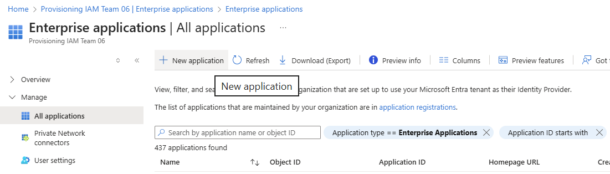

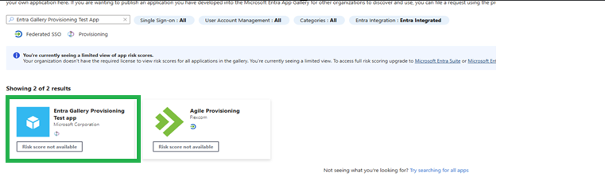

3.  Enter the name of your app, integration options, and click
    **Create**.

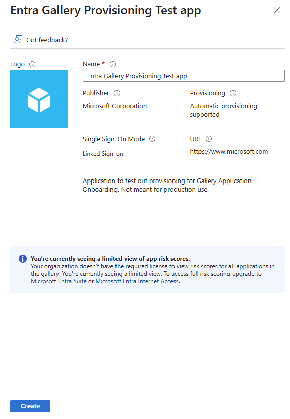

4.  Take note of the **Object ID** (this will be referred to as
    servicePrincipalID in the logic App).

5.  Set **Provisioning Mode** to **Automatic**, enter your bearer token
    details, and select **Test Connection**.

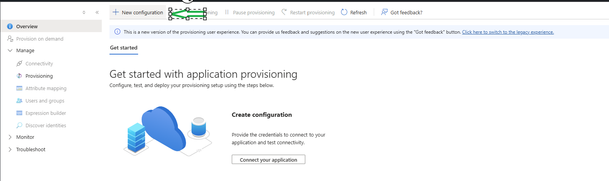

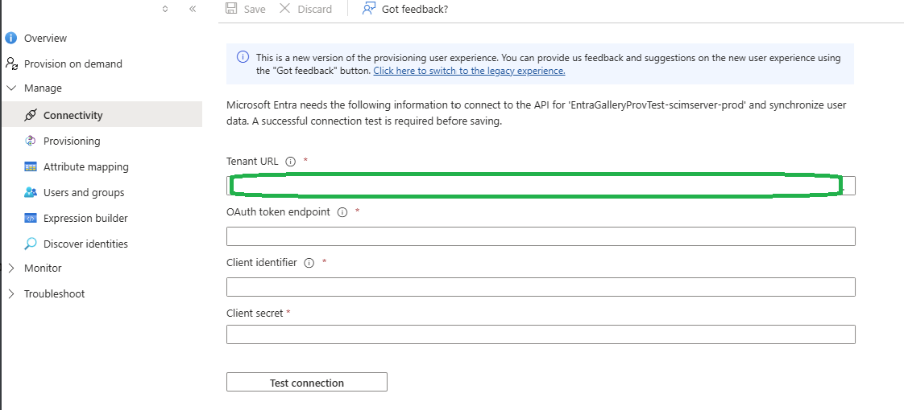

6.  Create a provisioning job by creating connection and set up schema
    by navigating to **Provisioning \> Mappings \> Provision Users**.
    For more details on how to customize schema, you can check out our
    public documentation here: [Tutorial - Customize Microsoft Entra
    attribute mappings in Application Provisioning - Microsoft Entra ID
    \| Microsoft
    Learn](https://learn.microsoft.com/en-us/entra/identity/app-provisioning/customize-application-attributes).

**Prune the schema** with only attributes/mappings required and
supported by the ISV. Select the checkbox **Show Advanced Options.**
Then the **Edit attribute list** link will be displayed. Select the link
and verify the attributes. Update/delete the attributes depending on the
schema supported by the ISV endpoint.

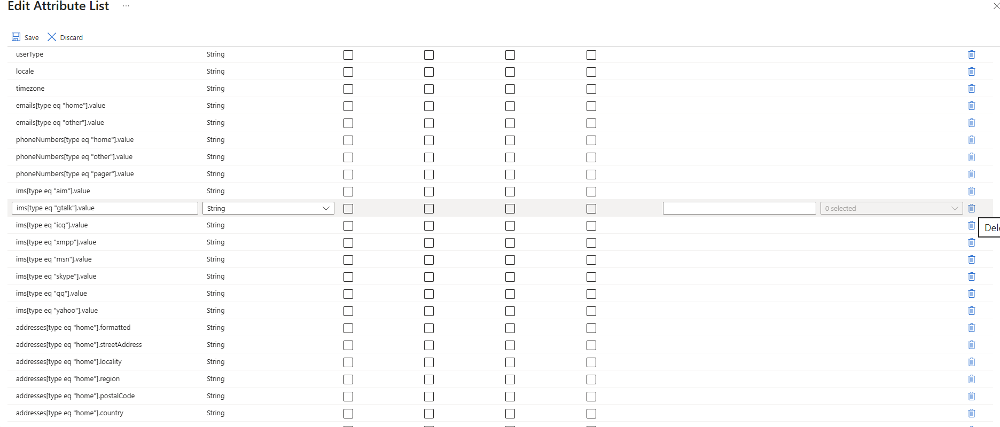

The schema can be exported by selecting “Review your schema here”. Then
select “Download” from the open schema editor.

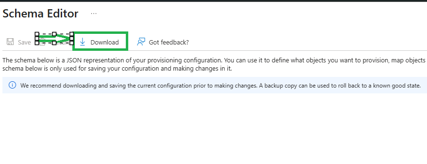

7.  In the **Overview** page, select **Start Provisioning** to start a
    provisioning job. If the provisioning job commences without errors,
    you are ready to move on to the next section.

8.  **Optional:** Once you’ve successfully started a provisioning job,
    submit an allow list request for faster sync cycles via this form:
    [Allow List for Self-Service Validation of Provisioning Integration
    (Pilot) – Fill out
    form](https://forms.microsoft.com/Pages/ResponsePage.aspx?id=v4j5cvGGr0GRqy180BHbR1xPIYfdXw5FhHBIH8BxY9ZUQ0w0UEczQTdLT1gzUTIyVzVNOUFHTjNGQS4u).
    The Entra App Provisioning team will then work on allow listing your
    tenant and provisioning job. Once complete, you will have access to
    sync cycles that run more frequently than the standard 40-minute
    sync cycle, allowing you to test and iterate upon your provisioning
    integration quickly.

### Set up a Logic app for running automated tests

Once you have set up a non-gallery SCIM app and started the sync, you
will use our provided Logic app template to validate your provisioning
integration and ensure that it is ready to publish to the Microsoft
Entra app gallery. Logic app runs user tests and group tests on ISVs
behalf by using the non-gallery SCIM app that you set up. 

Once we release the full private preview for the full onboarding and
publishing experience, a successful run of the Logic app template will
allow you to submit a publishing request for your provisioning
integration, after which we will review and deploy your app.

### Requirements

In the [Onboarding requirements section](#onboarding-requirements),
review the *Validation requirements* list to ensure that you have
everything you need to set up a Logic app.

### Instructions

1.  Sign in to the Azure portal at <https://portal.azure.com>. You
    should use the same tenant as the one where you set up your
    non-gallery SCIM app.

2.  Use the searchbar to navigate to the **Subscriptions** blade.

3.  Select the appropriate Azure subscription and create a resource
    group. This is the subscription and resource group that your Logic
    app will be attached to.

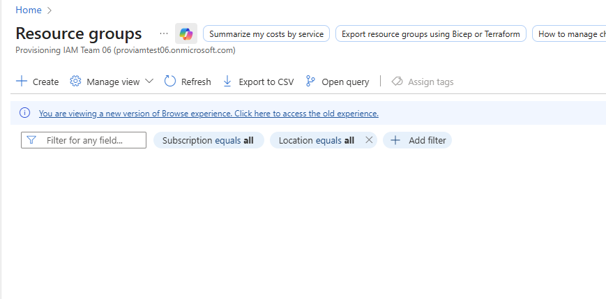

4.  Use the searchbar to navigate to the **Logic app**s blade.

5.  Select **Add \> WorkFlow Service Plan(Standard)**. *Note: The Logic
    app functioning on a Standard model means that you may be billed on
    your Azure description depending on level of usage. The amount is
    expected to be small—see the [Onboarding requirements
    section](#onboarding-requirements) for more details, under*
    Validation requirements*.*

6.  Provide Name , select the ResourceGroup created earlier.

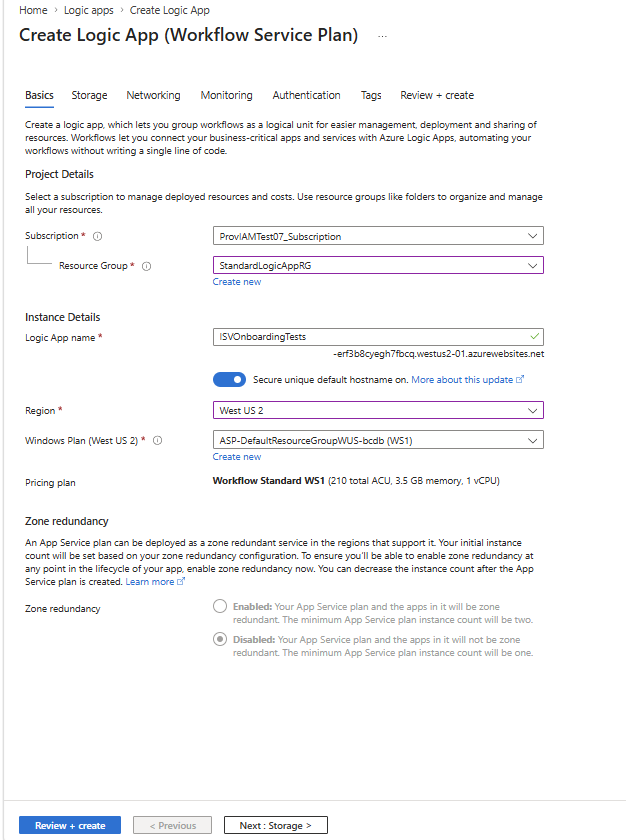

7.  Got to “Storage” tab. Change the “Blob service Diagnostics settings”
    to configure now and select the DefaultWorkspace.

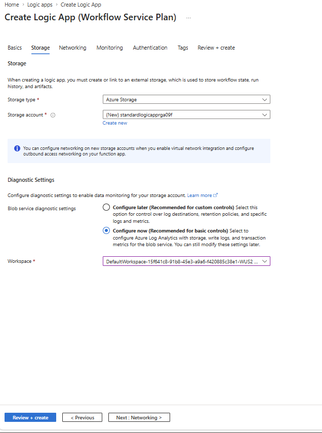

8.  Keep them as it is for the rest of the settings. Configure the
    settings of your Logic app as desired. Once you are done, click
    **Review + create**.

9.  Once the Logic app finishes deploying, open the Logic app.

10. Download all files from the **StandardLogicApp** folder of our GitHub repository: <https://github.com/AzureAD/SCIMReferenceCode/tree/master/Microsoft.SCIM.LogicAppValidationTemplate/StandardLogicApp> (the workflow JSON files — `Orchestrator_Workflow.json`, `Initialization_Workflow.json`, `UserTests_Workflow.json`, `GroupTests_Workflow.json`, `SCIMTests_Workflow.json` — plus `Orchestrator_Parameters.json` and `Deploy-LogicAppWorkflows.ps1`). Keep all the files in the same folder on your local machine.

11. You may choose to use Azure CLI or PowerShell for the following steps.

12. Open Azure CLI, Select all the files and upload all the files to
    Azure.

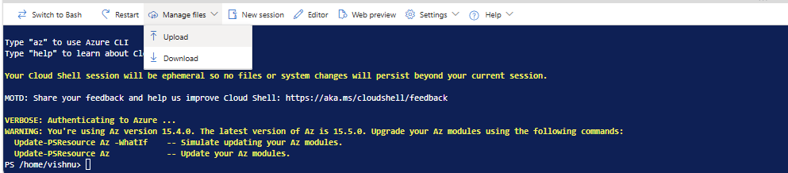

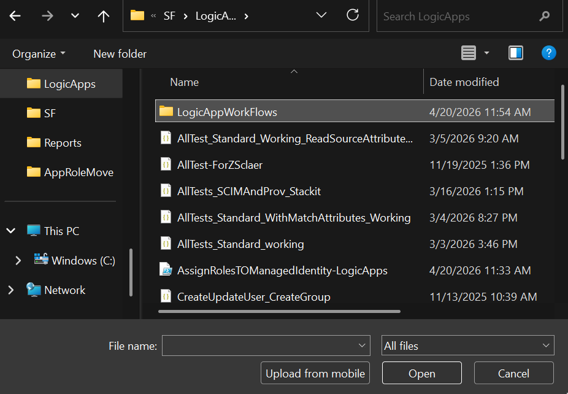

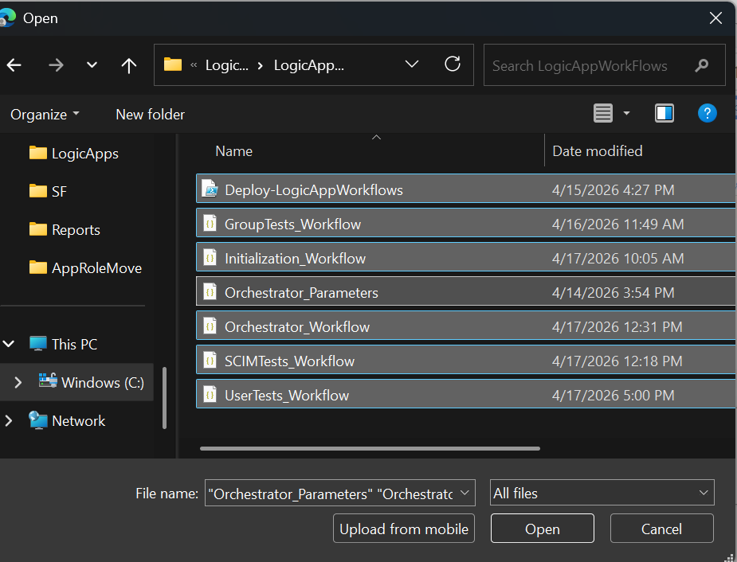

13. Get the Subscription, ResourceGroup and LogicAppName from the
    Overview page.

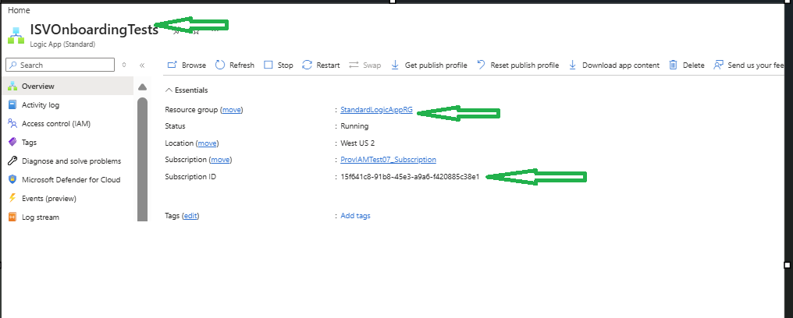

14. Run the following command

.\Deploy-LogicAppWorkflows.ps1 \`

-SubscriptionId \$subscriptionId \`

-ResourceGroup \$resourceGroupName \`

-LogicAppName \$LogicAppName

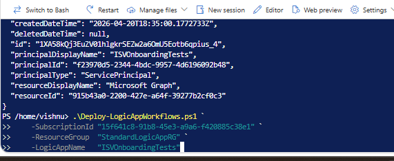

All the Workflows of the Logicapp are deployed as below.

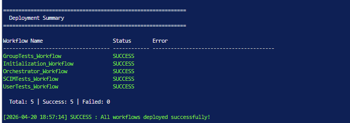

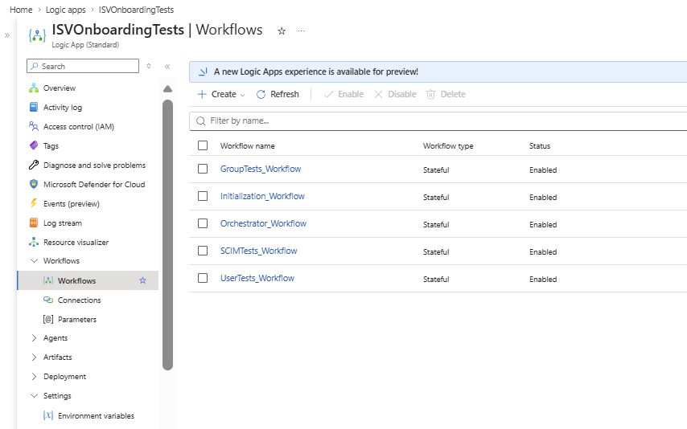

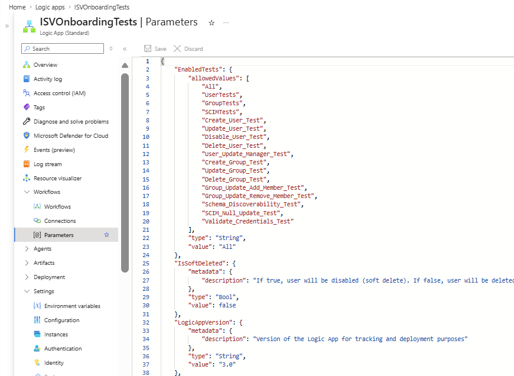

15. Next, we will enable system-assigned managed identity for secure
    resource access. Select **Settings \> Identity**.

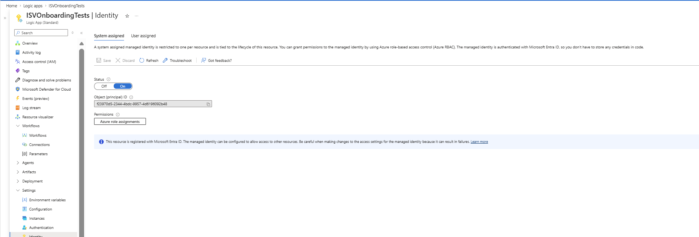

16. Set the **Status** in the **System assigned** tab to **On**. Select
    **Yes** in the confirmation dialog that pops up.

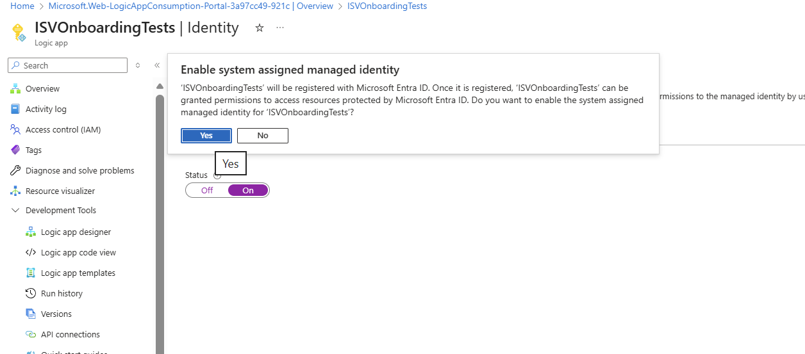

17. Select **Save**.

18. Take note of the object ID of the managed identity. You will need
    this object ID for the script that you will run in a few steps.

19. Now let’s work on granting the owner role to the Logic app. Select
    **Azure role assignments**.

20. In the **Azure role assignments** page, click on **Add role
    assignment** and select the **Owner** role.

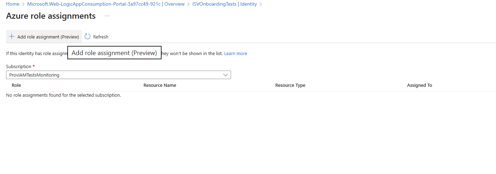

Once the owner role has been granted to the Logic app, you can now work
on assigning the proper permissions to the Logic app so that it can
invoke various Graph queries as part of the automated tests it will run
(the Logic app will create, update, and delete users and groups, query
provisioning logs, etc.).

You may choose to use Azure CLI or PowerShell for the following steps.

21. Go to the sample script provided in the
    [appendix](#script-for-assigning-permissions-to-your-logic-app) of
    this document. Copy the script for your records, and update the
    value of the **\$miObjId** field with the object ID of your Logic
    app’s managed identity.

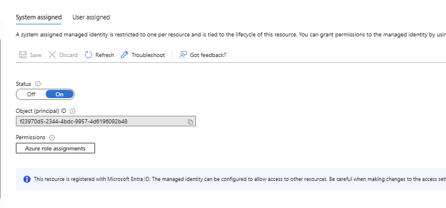

22. Run the script using the command-line interface of your choice. If
    using a UI like Azure Cloud Shell that provides you with an option
    to upload a file, you may opt to copy the script into a file, upload
    the file, then run the script.

*<u>How to upload and run a script using Azure Cloud Shell</u>*

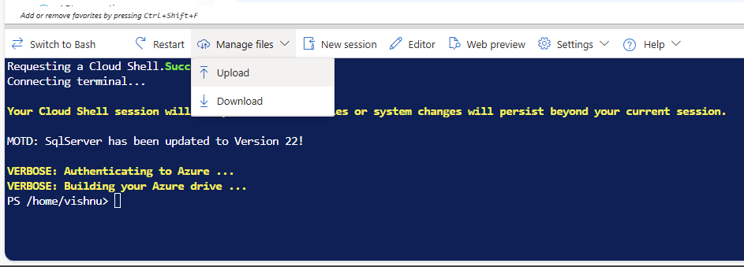

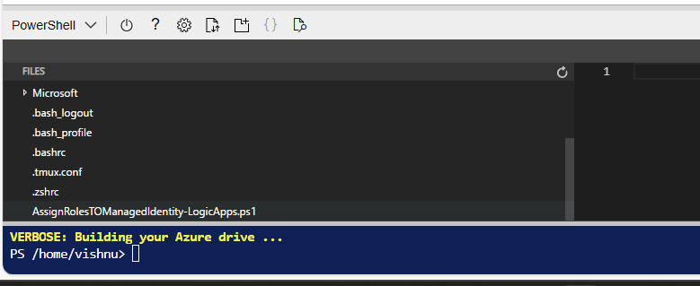

Once the script successfully runs, you will have assigned all the
necessary roles to the managed identity of your Logic app.

### Logic App Explanation:

The Logic App is built on Azure Logic Apps Standard and is divided into
separate sections. It consists of 5 workflows that work together using a
nested workflow architecture. The Orchestrator workflow is the entry
point, and it calls the other workflows as child workflows.
Initialization workflow initializes the required steps to run the tests
in the Logic App. 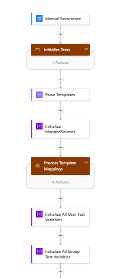

The next section contains the tests. Tests are bundled into user and
group and scim workflows. All the User Tests are in ‘UserTests_workflow’
and Group tests in ‘GroupTests_worklfow’ and SCIM tests in
“SCIMTests_workflow’. Each test can be run individually or all together
using the \`EnabledTests\` parameter.

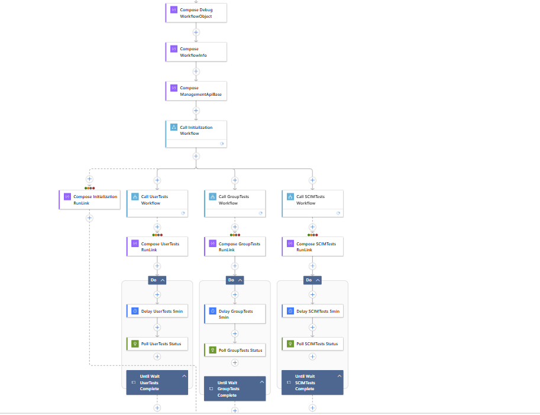

You can select each workflow and can view the tests it has in the
Designer.Each test can be further drilldown by selecting the down arrow
and to get into details of stages and the actions. Each stage and action
can be drilled down till the inputs and outputs are displayed for each
action.

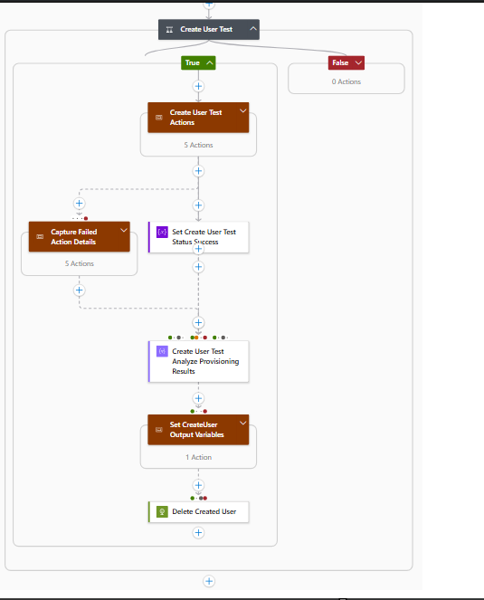

The last section in the Orchestartor_workflow is for post run results
evaluation.

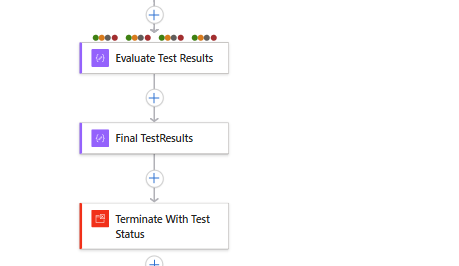

## Run: Steps to Run Logic app

Before we run your Logic app, let’s provide values for your Logic app’s
required run parameters. Save the Logic app after updating parameters
before Run. Open Orchestrator WorkFlow in Designer and Update the
Parameters .

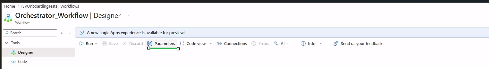

### Providing Values To Parameters

23. The **servicePrincipalId** is the **objectId** of the non-gallery
    SCIM app you created in the [previous section](#_Set_up_your).

24. Enter your SCIM endpoint.

    1.  **Note**: don’t include feature flags like aadOptscim062020 in
        the scim endpoint here. Even if you have to configure your non
        gallery app with feature flags.

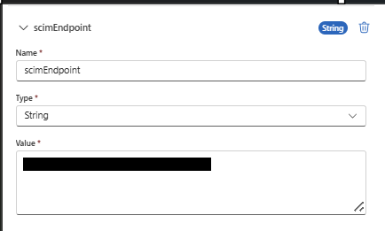

25. Enter your SCIM bearer token.

26. Under **testUserDomain**, enter a verified domain that belongs to
    your tenant. This domain will be used to create test users in Entra
    ID and provision them to your SCIM endpoint as part of the automated
    tests that the Logic app template will run. *Note: A Logic app
    template that successfully completes all tests will clean up any
    test users that were created during that run. If the Logic app
    template does not complete a full, clean run, test users may not be
    cleaned up. For example, stubs of the test user accounts will remain
    in your tenant if the Logic app template fails the Delete User tests
    or if you choose to interrupt the Logic app template before it has
    the chance to complete delete operations.*

27. Under defaultUserProperties give the different sets of user
    Properties values to test. The Logic App takes one choose one set of
    the defaultUserProperties to create User and another set for
    updating User. Selection is random based on no. of sets.

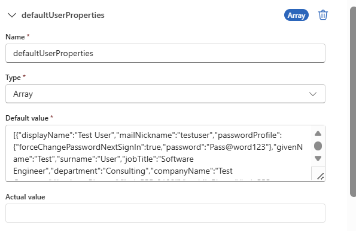

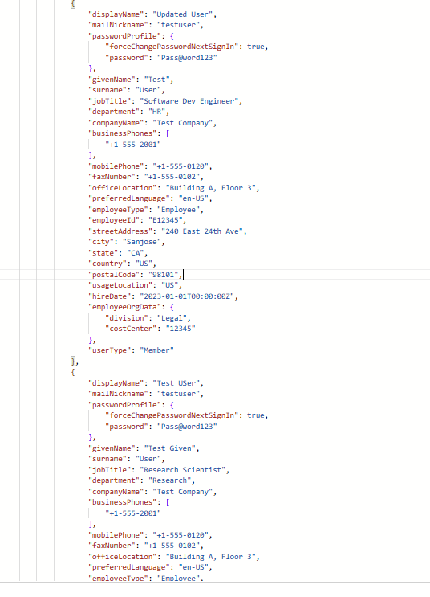

**  **

28. **EnabledTests** can take one of the below values. We support
    running all tests in parallel, running individual tests, or running
    tests related to only users or only groups. ***Only one value should
    be provided.***

**“All” -** All tests will run

**“UserTests” -** All of the User Tests will run. Groups and SCIM Tests
are skipped.

**“GroupTests” –** All of the Group Tests will run. User and SCIMTests
are skipped.

**“SCIMTests” –** All of the SCIM tests will run. User and Group test
will be skipped

> "All",

                    "UserTests",

                    "GroupTests",

                    "Create_User_Test",

                    "Update_User_Test",

                    "Delete_User_Test",

                    "User_Disable_Test",

                    "User_Update_Manager_Test",

                    "Create_Group_Test",

                    "Update_Group_Test",

                    "Delete_Group_Test",

                    "Group_Update_Add_Member_Test",

                    "Group_Update_Remove_Member_Test",

“Schema_Discoverability_Test”,

“SCIM_Null_Update_Test”,

“Validate_Credentials_Test”

29. IsSoftDeleted can be ‘true’ or ‘false’. Set to true only if soft
    deletion is supported and defined in your SCIM schema. This property
    indicates that the user resource is marked for soft deletion—meaning
    it is flagged for removal but not permanently deleted.
    “Disable_User_Test’ and “Delete_User_Test” are dependent on the
    correct value of this parameter. If ‘IsSoftDeleted’ is false, then
    “Disable_User_Test” will be skipped.

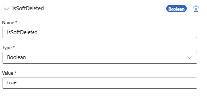

30. Update scimClientId with client id.

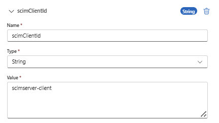

31. Update client secret

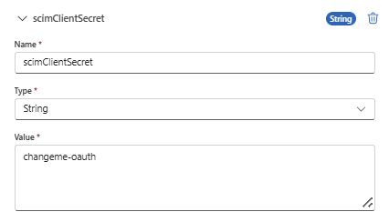

32. Update ISV token endpoint

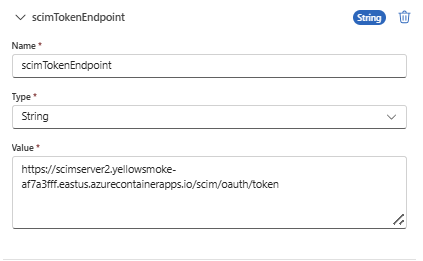

## Run the Logic App

33. You’re now ready to run the Logic app! Navigate to **WorkFlows\>**
    Select **Orchestrtor_workflow**,
    

34. From the Orchestartor_workflow’s designer, select “**Run**”

### Post-Run: Verify the Runs and the next steps

## Verify the Runs

35. You can view logs of your runs in the **Runs history** blade. When
    clicking on an entry in **Runs history**, you check the final
    results of that entry, including the list of tests that were run,
    alongside status and any errors that may have come up.

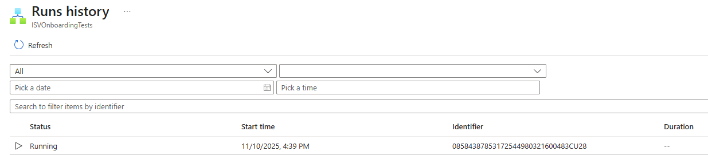

## Debugging

36. Debugging Logic App:

Check the Final_TestResults action of the Orchestrator_workflow’s run to
learn about the tests and their results.

In Final_TestResults -\> Select 'Show raw Outputs’.

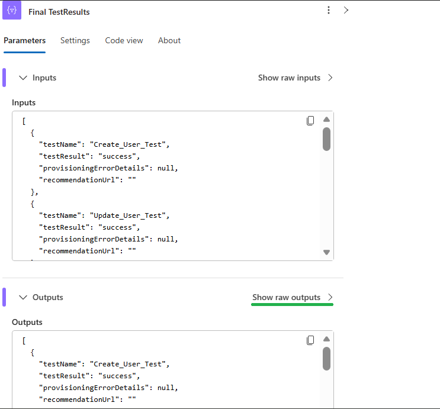

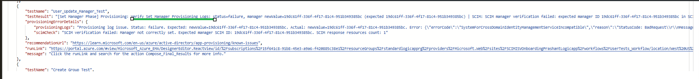

For each test, “testResult” shows the success / failure / skipped. In
case of failure the phase and action name for the failure is displayed.
Copy the action name. “Ctrl + Click” on the runLink. It opens the child
workflows run. Search the action name and can debug and look furthermore
for error details. Tip section below shows how to debug further and
search for specific actions. Identify the failures from failed actions
inputs/outputs give further details about why that call is failed.
Verify if the schema is valid and all the parameters are set according
to the Schema. Fix the parameters or schema and run the logic app again.

“provisioningErrorDetails” gives the glimpse of Error information in
case of failure.

*Tip:* More details about the run can be found by drilling down to the
test definition and checking the input/output. Here’s a sample of how
the output may look like:

*Another tip:* Go to the run you want to debug further. In the left you
can query for a specific stage / action on the magnifying glass icon.

## Test Results

37. Once you see the tests have passed and you are ready to move to
    onboarding. Provide the test results for us to validate and onboard.

Run the Powershell validation script and provide us with the generated
JSON file.

> **Prerequisites**

- **PowerShell Version 7.0+**: Install
  from [https://aka.ms/powershell](vscode-file://vscode-app/c:/Users/v-mchittoory/AppData/Local/Programs/Microsoft%20VS%20Code/resources/app/out/vs/code/electron-browser/workbench/workbench.html) or
  PowerShell 5.1 with \`-SkipActionDetails\` flag

- **Azure Role** - Reader or Logic App Operator on the Logic App
  resource

- **Azure CLI** - Install from <https://aka.ms/installazurecli>

> **Note:** The script uses Azure CLI internally to obtain access tokens
> for Azure Resource Management (ARM) API calls.
>
> **31.1 Login to Azure**
>
> Open PowerShell and run:
>
> az login
>
> \# Set the subscription you want to use
>
> az account set --subscription "YOUR_SUBSCRIPTION_ID"
>
> **31.2 Run the Validation Script**
>
> Download the Validation script provided in the appendix.
>
> Navigate to the script directory and run:
>
> .\ValidateLogicAppRun-Standard.ps1 \`
>
>     -SubscriptionId "YOUR_SUBSCRIPTION_ID" \`
>
>     -ResourceGroup "YOUR_RESOURCE_GROUP" \`
>
>     -LogicAppName "YOUR_LOGIC_APP_NAME" \`
>
>     -RunId "YOUR_RUN_ID"
>
> **Where to find these values:**

- Subscription ID: Azure Portal → Subscriptions → Your Subscription →
  Copy the ID

- Resource Group / Logic App Name: Azure Portal → Your Logic App →
  Overview

- Run ID: Azure Portal → Your Logic App → Run History → Copy the Run ID

> **Optional Parameters:**
>
> -SkipActionDetails: Skip fetching action inputs/outputs (faster
> execution, works with PowerShell 5.1)
>
> **Note:** If copy-pasting the command, verify that hyphens (-) before
> parameters are correct, as some applications replace them with
> different dash characters.
>
> **Example**
>
> .\ValidateLogicAppRun-Standard.ps1 \`
>
>     -SubscriptionId "12345678-1234-1234-1234-123456789012" \`
>
>     -ResourceGroup "rg-provisioning-prod" \`
>
>     -LogicAppName "la-scim-validator" \`
>
>     -RunId "08584361051946613703020273411CU28"
>
> **31.3 Submit Results**
>
> Send us the generated JSON file:
> validation-result-{RunId}.json
>
> The script displays **VALIDATION PASSED** (green) or **VALIDATION
> FAILED** (red) in the console upon completion.
>
> **What Gets Validated**

- Run completed successfully

- No failed actions

- All required provisioning stages executed (dynamically extracted from
  template)

- All template actions executed (no modifications)

> **Troubleshooting the Validation Script**

<table style="width:92%;">
<colgroup>
<col style="width: 45%" />
<col style="width: 46%" />
</colgroup>
<thead>
<tr>
<th>Issue</th>
<th>Solution</th>
</tr>
</thead>
<tbody>
<tr>
<td>"Authentication failed"</td>
<td>Run az login and sign in again</td>
</tr>
<tr>
<td>"Cannot access Logic App"</td>
<td>
Verify subscription ID, resource group, and Logic App name.

Check you have proper Azure permissions.
</td>
</tr>
<tr>
<td>"No subscriptions found"</td>
<td>Wait 5-10 minutes after role assignment, then run az account
clear and az login</td>
</tr>
<tr>
<td>Script execution policy error</td>
<td>Run: <mark>Set-ExecutionPolicy RemoteSigned -Scope
CurrentUser</mark></td>
</tr>
<tr>
<td>"This script requires PowerShell 7.0 or later for parallel
processing."</td>
<td>Install PowerShell 7+ or run
with <mark>-SkipActionDetails</mark> flag</td>
</tr>
</tbody>
</table>

> **Understanding Results**

- **VALIDATION PASSED** - Run succeeded with valid template

- **VALIDATION FAILED** - Check the JSON report for:

<!-- -->

- **validationErrors** - High-level issues

- **failedActions** - Specific errors with details

- **templateValidation.requiredStages** - Stage execution status

- **actionComparison** - Missing or modified actions detected

When we release the full self-service onboarding experience for
provisioning integrations, you will provide us with a **Run ID**
associated with a successful run of your Logic app (alongside details
such as the subscription and resource group that your Logic app is
associated with). Run IDs will be valid for a finite number of days,
during which we will review your submission and work on deploying your
provisioning integration to the Microsoft Entra app gallery. You will be
given access to this experience when it releases to Private Preview in
CY2026.

## Next Steps after successful run

Provide us the following information.

1.  Generated Logic App test results as described in [Test
    Results](#_Test_Results) section.

2.  \[Required only if your run was done on Logic app template published
    before 02/09\] Export Pruned Schema as mentioned in Logic App setup
    instructions or as mentioned in [Export Application Provisioning
    configuration and roll back to a known good state for disaster
    recovery in Microsoft Entra ID - Microsoft Entra ID \| Microsoft
    Learn](https://learn.microsoft.com/en-us/entra/identity/app-provisioning/export-import-provisioning-configuration#export-your-provisioning-configuration)

3.  Since this is a pilot, we would like to run the tests ourselves as a
    sanity check. This step will not be required once we build an
    end-to-end experience. For this, we will need the SCIM endpoint and
    a long-lived bearer token. Please also let us know if there are any
    constraints (for example, a required domain for the
    userPrincipalName)

# Understanding the Test Results

The Logic App runs 13 tests: 5 User tests, 5 Group tests, and 3 SCIM
compliance tests. This section explains how to find and read the
results.

### Where to Find the Results

**If using the agent (Method A):** The agent fetches and displays the
results automatically. No portal navigation needed.

**If using manual setup (Method B):** 1. In the Azure portal, go to your
Logic App → **Workflows** → **Orchestrator_Workflow** 2. Click **Run
history** and select your run 3. Find the action called
`Final_TestResults` (near the bottom of the workflow) 4. Click on it →
select **Show raw outputs** 5. The JSON output contains all test results

### The Results JSON Structure

Each test result in the `Final_TestResults` output looks like this:

    {
      "testName": "Create_User_Test",
      "testResult": "success",
      "provisioningErrorDetails": "",
      "recommendationUrl": "",
      "runLink": "https://portal.azure.com/#view/...",
      "message": "Click the runLink and search for the action Compose_Final_Results for more info."
    }

Here’s what each field means:

| Field | What It Tells You |
|----|----|
| `testName` | The name of the test (e.g., `Create_User_Test`, `Update_Group_Test`) |
| `testResult` | `"success"` if the test passed. If the test failed, this contains the failure description including the phase and action name that failed (e.g., `"FAILED - [Delete Phase] Failed Action: Delete_Step5_Delete_Group_By_Id"`) |
| `provisioningErrorDetails` | Empty if the test passed. On failure, contains the HTTP status code, error body, and error message from the Graph API or SCIM endpoint call that failed. **This is the most important field for debugging.** |
| `recommendationUrl` | A link to Microsoft documentation that may help resolve the issue |
| `runLink` | A direct link to the child workflow run in the Azure portal. Click this to drill into the workflow designer and inspect individual action inputs/outputs. |
| `message` | Instructions on how to find more details in the workflow run |

### Possible Test Result Values

| Result | Meaning | Action Required? |
|----|----|----|
| `"success"` | Test passed — your SCIM endpoint handled the operation correctly | ✅ None |
| `"FAILED - [Phase] Failed Action: <action_name>"` | Test failed at a specific action. The phase (e.g., Create Phase, Update Phase, Delete Phase) and action name tell you exactly where it broke. | ❌ Yes — see Debugging below |
| `"skipped"` | Test was skipped because a prerequisite was not met (e.g., `Disable_User_Test` skipped when `IsSoftDeleted` is `false`, or group tests skipped when groups are not supported) | ✅ None (if intentional) |
| `"Token acquisition failed"` | Only for `Validate_Credentials_Test` — the OAuth token request failed. Expected when using a static bearer token. | ✅ None (if using static token) |
| `"The SCIM schema does not support all attributes..."` | `Schema_Discoverability_Test` found that your SCIM schema doesn’t advertise all the attributes in the provisioning mappings. The details show how many are supported vs mapped. | ⚠️ Prune your attribute mappings to match |

### Sample Results — All Tests Passed

    {
      "testResults": [
        { "testName": "Create_User_Test", "testResult": "success" },
        { "testName": "Update_User_Test", "testResult": "success" },
        { "testName": "Disable_User_Test", "testResult": "success" },
        { "testName": "Delete_User_Test", "testResult": "success" },
        { "testName": "User_Update_Manager_Test", "testResult": "success" },
        { "testName": "Create_Group_Test", "testResult": "success" },
        { "testName": "Update_Group_Test", "testResult": "success" },
        { "testName": "Delete_Group_Test", "testResult": "success" },
        { "testName": "Group_Update_Add_Member_Test", "testResult": "success" },
        { "testName": "Group_Update_Remove_Member_Test", "testResult": "success" },
        { "testName": "Schema_Discoverability_Test", "testResult": "success" },
        { "testName": "SCIM_Null_Update_Test", "testResult": "success" },
        { "testName": "Validate_Credentials_Test", "testResult": "Token acquisition failed" }
      ],
      "overallResult": "Failed"
    }

> **Note:** Even with 12/13 tests passing, the `overallResult` shows
> `"Failed"` because `Validate_Credentials_Test` did not pass. This is
> expected when using a static bearer token — it does not block
> onboarding.

### Sample Results — With a Failure

    {
      "testName": "Delete_Group_Test",
      "testResult": "FAILED - [Delete Phase] Failed Action: Delete_Step5_Delete_Group_By_Id",
      "provisioningErrorDetails": {
        "provisioningLogs": {
          "statusCode": 403,
          "body": {
            "error": {
              "code": "Authorization_RequestDenied",
              "message": "Insufficient privileges to complete the operation."
            }
          }
        }
      }
    }

**How to read this failure:** - `testResult` tells you it failed during
the **Delete Phase** at the action `Delete_Step5_Delete_Group_By_Id` -
`provisioningErrorDetails` shows the actual HTTP error: **403** with
`Authorization_RequestDenied` — the Logic App’s managed identity doesn’t
have sufficient permissions - **Fix:** Assign the missing Graph API
permission to the managed identity and re-run

### How to Debug a Failed Test

7.  **Read** `provisioningErrorDetails` in the results JSON — this
    usually tells you the root cause (HTTP status code + error message)
8.  **Click the** `runLink` — this opens the child workflow run in the
    Azure portal
9.  **Search for the failed action name** (from `testResult`) in the
    workflow designer
10. **Click the failed action** → check **Inputs** (what was sent) and
    **Outputs** (what came back)
11. The HTTP response body in the outputs contains the exact error from
    the Graph API or your SCIM endpoint

**If using the agent (Method A):** The agent does steps 1–5
automatically and tells you the root cause and fix.

### What “Passing” Means for Onboarding

To proceed with gallery onboarding, **all applicable tests must pass**.
The following are acceptable exceptions: - `Validate_Credentials_Test`
failing when using a static bearer token (OAuth will be required for
production) - `Schema_Discoverability_Test` showing a mismatch — prune
the attribute mappings in the Entra portal to match your SCIM schema -
Group tests being skipped if your application does not support group
provisioning

## Automatic Failure Diagnosis

If tests fail, the agent automatically:

12. Fetches the `Final_TestResults` from the Orchestrator workflow
12. Drills into child workflow actions to find the actual HTTP error
13. Matches against known issue patterns
14. For auto-fixable issues (e.g., missing permissions, schema
    validation errors, feature flags in endpoint), applies the fix and
    re-runs automatically
15. For ISV-side issues (e.g., SCIM filter not supported, 404 on empty
    queries), explains exactly what to fix

### Common Auto-Fixed Issues

| Issue | What the Agent Does |
|----|----|
| `aadOptscim062020` feature flag in endpoint | Removes the flag from parameters, re-runs |
| Missing Graph API permission | Assigns the missing permission, waits for propagation, re-runs |
| Schema validation error (canonical values) | Extracts allowed values, updates user profiles, re-runs |
| Missing fields in `defaultUserProperties` | Adds the missing property to all user profiles, re-runs |

### Issues Requiring Your Action

| Issue | What You Need to Do |
|----|----|
| Bearer token expired | Provide a new long-lived token |
| SCIM filter not supported | Implement filter support on matching properties |
| 404 on empty filter queries | Return 200 + empty results (mandatory) |
| Group PATCH not supported | Implement multi-member PATCH on /Groups |
| Rate limiting (429) | Support ≥25 req/s |

------------------------------------------------------------------------

# Frequently Asked Questions: 

Note: Below are some of the known issues and most probable explanations.
Each issue could be caused by many other reasons too.

1.  **Why do errors occur when the aadOptscim062020 feature flag is used
    with a Logic App SCIM endpoint?**

**Explanation  **
The aadOptscim062020 feature flag is supported only for Microsoft Entra
ID provisioning scenarios. This flag is not required in logic app
configuration. When it is configured on a Logic App SCIM endpoint, SCIM
GET requests may fail with Bad Request errors.

**Resolution  **
Remove the aadOptscim062020 flag from the Logic App SCIM endpoint
configuration.  
Configure this flag only while setting up connection in non gallery app
by going to:

Microsoft Entra ID → Enterprise Application → Provisioning → Tenant URL

2.  **Why do Logic App test runs fail intermittently due to
    authentication issues?**

**Explanation  **
Logic App test runs can exceed the lifetime of short-lived access
tokens. When a token expires during execution, authentication failures
may occur.

**Resolution  **
Use long-lived access tokens when running Logic App tests.

3.  **Why does the Get_Templates action return an Unauthorized error?**

**Explanation  **
The Logic App’s Managed Identity does not have sufficient permissions to
access the required template resources.

**Resolution  **
Assign the appropriate roles to the Managed Identity and allow time for
permission changes to take effect.  
If the issue continues, recreate the Logic App and reconfigure the
Managed Identity and permissions.

4.  **Why do SCIM requests with attribute-based filters fail?**

**Explanation  **
Microsoft Entra ID can issue SCIM GET requests with filters on **any
attribute configured as a matching property**. When such a request is
sent, the target SCIM endpoint is expected to support filtering on that
matching property.

If the SCIM server does not support filtering on one or more matching
properties configured in Entra ID, the filtered request may fail and
appear as an error in provisioning logs.

**Resolution  **
Ensure that the SCIM endpoint supports filtered GET requests for **all
attributes configured as matching properties** in:

Enterprise Application → Provisioning → Attribute Mappings

**Examples**

- **Email as a matching property**  
  If emails\[type eq "work"\].value is configured as a matching
  property, the SCIM endpoint must support filtering on this attribute.
  The following example API call **must be supported**:

> GET /scim/v2/Users?filter=emails\[type eq "work"\].value eq
> "user@contoso.com"

5.  **Why do Logic App tests fail with a SCIM 409 Conflict error?**

**Possible Explanation  **
In some scenarios, the SCIM service may not respond as expected to
update requests, which can result in retry attempts and a 409 Conflict
error.

**Resolution  **
Re-run the test to confirm whether the issue is transient.  
If the issue occurs consistently, verify that the SCIM service responds
correctly to update requests and does not introduce response delays.

6.  **Why does a Logic App SCIM GET API call fail when querying a
    nonexistent user?**

**Explanation**  
The SCIM specification allows a server to return a 404 Not Found
response when a queried user does not exist. Although this behavior is
SCIM compliant, it is not supported by this system.

This system requires SCIM servers to return a **successful response (200
OK) with zero results** for filter-based queries that do not match any
users. If a SCIM server returns a 404 Not Found response for a
nonexistent user, the Logic App SCIM GET call fails due to
incompatibility with the expected response behavior.

**Resolution**  
As part of onboarding, ensure that the SCIM endpoint is configured to
return a **200 OK response with zero results** (for example,
totalResults: 0 and an empty Resources array) when a queried user does
not exist.

This behavior is a **mandatory onboarding requirement** and is validated
during the onboarding checklist process.

# Provide feedback

Once you get a chance to test the pilot, please fill out the following
feedback form: [Feedback Form for Self-Service Validation of
Provisioning Integrations (Pilot) – Fill out
form](https://forms.microsoft.com/Pages/ResponsePage.aspx?id=v4j5cvGGr0GRqy180BHbR1xPIYfdXw5FhHBIH8BxY9ZUNTJTRkc0SDUxOTdHSFk5UEZQVkVZRjhTMy4u)

In the form, you may specify whether you are interested in participating
in a follow-up feedback session with the Entra App Provisioning feature
team. In this feedback session, we would ask you more questions about
your experience.

We’re excited to hear more from you! Thank you for participating in our
pilot—your insights help us make Microsoft Entra ID better.

# Appendix

## Script for assigning permissions to your Logic app

[SCIMReferenceCode/Microsoft.SCIM.LogicAppValidationTemplate/AssignRolesTOManagedIdentity-LogicApps
1.ps1 at master · AzureAD/SCIMReferenceCode ·
GitHub](https://github.com/AzureAD/SCIMReferenceCode/blob/master/Microsoft.SCIM.LogicAppValidationTemplate/AssignRolesTOManagedIdentity-LogicApps.ps1)

## Script for Logic App Validation

[SCIMReferenceCode/Microsoft.SCIM.LogicAppValidationTemplate/StandardLogicApp/ValidateLogicAppRun-Standard.ps1
at master ·
AzureAD/SCIMReferenceCode](https://github.com/AzureAD/SCIMReferenceCode/blob/master/Microsoft.SCIM.LogicAppValidationTemplate/StandardLogicApp/ValidateLogicAppRun-Standard.ps1)
